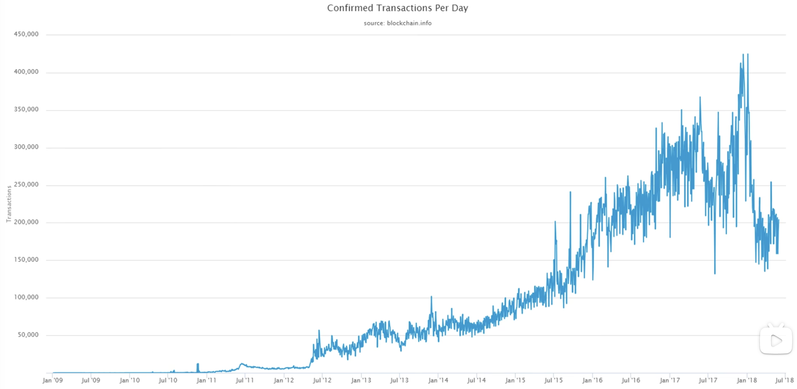

# 问题
## 交易时收款方未登陆BTC网络怎么办
不需要接受者在线，BTC转账只是在区块链中记录一笔转账，将我账户上的BTC转给他的账户。

## 假设某个全节点收到某个转账交易，有无可能接受者的收款地址是节点以前从未听说过的
有可能，BTC账户创建时无需通知他人，只在本地产生公私钥对即可。只有在以后某次这个地址第一次收到钱时，其他节点才知道账户的存在

## 如果账户私钥丢失该怎么办
没有办法，账户上的钱就变成了死钱，无法取出。这和生活中的体验不一样，例如银行可以通过查验身份，来重置密码。BTC去中心化网络中，无法这样做。
一些加密货币的交易所，这些交易所是中心化机构，开户时需要提交身份证明。这种情况下保存BTC到交易所，私钥实际上是由交易所保管。登陆交易所是按照登陆银行差不多的程序，有用户名，密码，二次验证等。

## 如果私钥泄漏怎么办
尽快将帐号上钱转移到安全账户

## 转账时写错地址怎么办
没有办法取消已经发布的交易。BTC转账交易一旦发布到区块链上，是没办法取消掉的。

## proof of burn和op_return在实际中如何操作
全节点收到交易时，校验合法性，合法才会写入区块链。但是return语句是无条件返回错误的，此时怎么写入区块链？
答案是，return语句是写入当前交易的输出脚本里，而验证当前交易合法性，是把交易的输入脚本，和BTC来源交易的输出脚本拼在一起执行。这个过程不会执行当前交易的输出脚本。
只有在以后有别的交易要花这笔钱时，才会执行这个记录了return语句的脚本。这时我们保证这笔交易没有剩余的BTC，就不会有人再执行他了。

## BTC挖矿时，有没有矿工偷答案
矿工A发现了nonce，组装区块发布出去。矿工B收到后，将其伪装成自己的区块，也发布出去。
不会有这种情况，发布区块里有coinbase transaction，里面有收款地址字段。偷答案时要修改其为自己地址，而此时整个交易的内容发生改变，进而导致merkle tree root hash内容改变，整个区块的hash也会改变，导致不符合puzzle target。

## 交易费可以看做是发生交易时给矿工的消费，那么如何知道该给哪个矿工
发生交易时，total inputs > total outputs，其中的差额就是交易费。此时不需要知道该给哪个矿工。而是交易被某个区块打包记录时，直接给生成区块的矿工即可。

# BTC相关统计数据
## 区块链大小

因为区块链是append only ledger。

## UTOX集合大小

总趋势是不断变大，主要原因是交易多了。还有一些账户可能私钥丢失，这些记录会永久保留在UTXO。

## 矿池挖矿情况

挖矿集中化情况比较严重，几个大矿池占了系统中总算力很大一部分。

## BTC价格变化情况

## BTC市值变化情况

和价格变化基本一致

## BTC交易量

## 每日交易数目

总趋势也是不断增长。

## 每个区块平均交易数量

每天产生的区块数目基本一致，而交易数目的变化主要就是因为每个区块里的交易数目发生了变化。