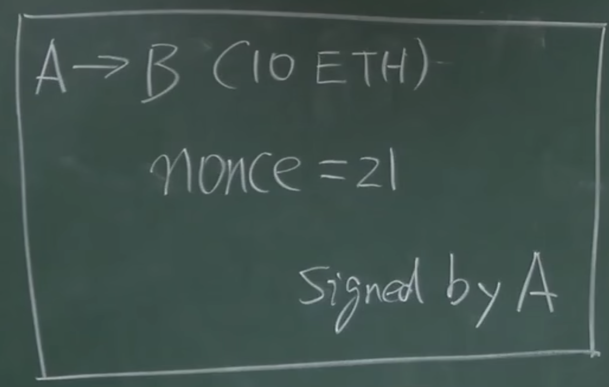

# 和BTC的区别
BTC系统中并没有账户显示记录有多少钱，只能通过UTXO计算。这种模式好处是隐私保护比较好，但是带来问题使用不够便利。
转账时，A要转给B十个BTC。需要说明币的来源合法性。
另外一个比较别扭的地方，就是要花一笔钱时，要把币的来源中带的所有比特币，都花出去。否则剩余的钱会都成为矿工手续费。

ETH系统使用的是基于账户的模型账本，account-based ledger，系统中要显示记录每个账户有多少个ETH。
这样的好处是不会出现double spending。

另外有一种攻击，叫做replay attack，重放攻击。例如A向B转账10个ETH，之后这币转账被写入区块。但是B有恶意，过一段时间后，B向网络中又广播了一次这币交易，其他节点也会收到这次交易的信息。

ETH防护这种攻击的方法是，加一个计数器nonce，记录这个账户创建以来，发布过多少次交易。交易次数会成为交易内容的一部分，受到签名保护。

系统中每个节点不止要维护账户的balance，还要维护账户的nonce。

# ETH账户类型
有两类账户
1. 外部账户externally owned account。类似BTC中的账户，由公私钥对控制。也叫普通账户。有账户余额，nonce等性质。注意此处的nonce和BTC中挖矿时填入的nonce不同，这里的nonce是个计数器。
2. 合约账户smart contract account。不是通过公私钥对控制，不能主动发起交易。除了balance和nonce性质外，还有代码code，以及相关的状态storage。

创建合约时，会返回一个地址，调用该地址，即可调用合约。

# 为什么要设计区别于BTC新的模型
以太坊考虑到过去已有模型的利弊，没有采用BTC基于交易的模型，而是采用基于account的模型。