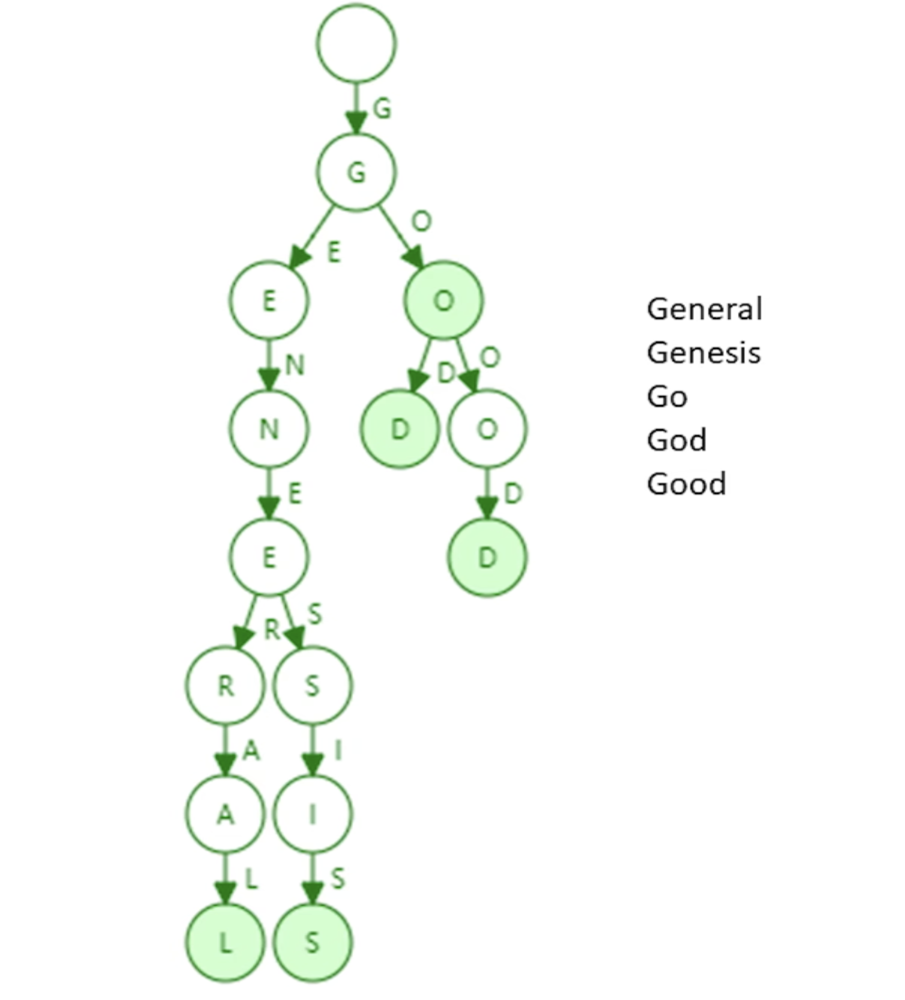
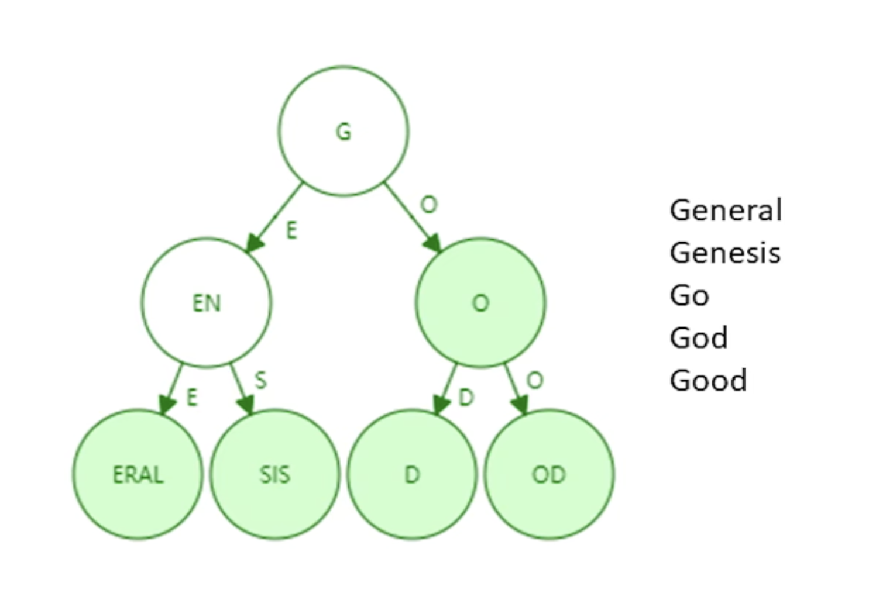
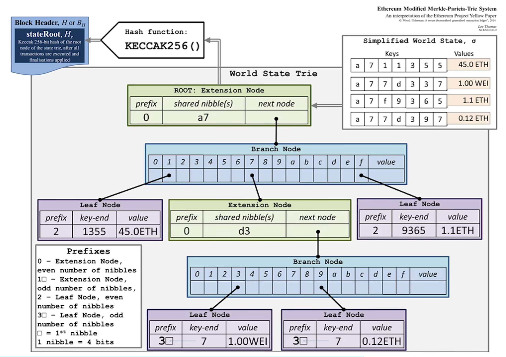
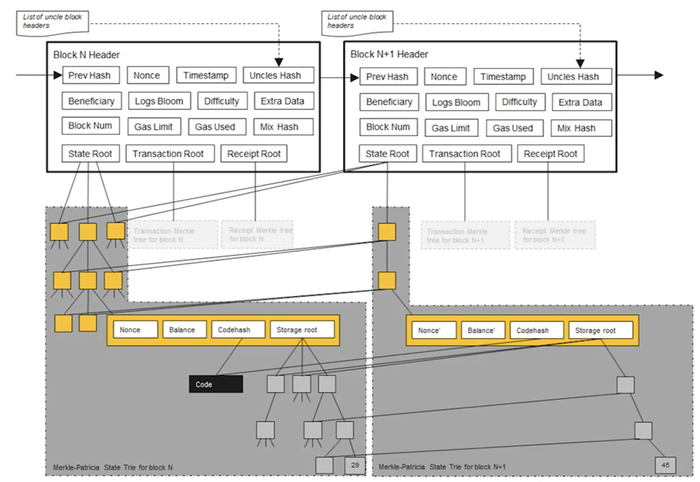
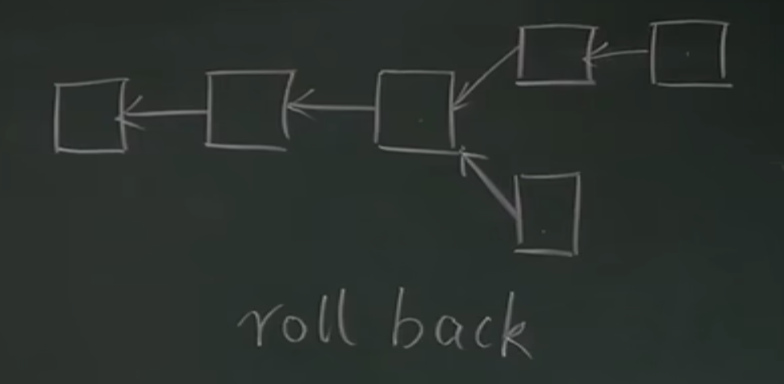
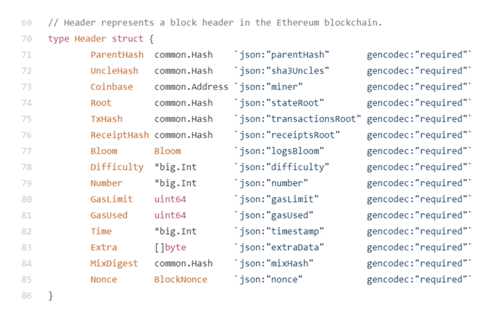
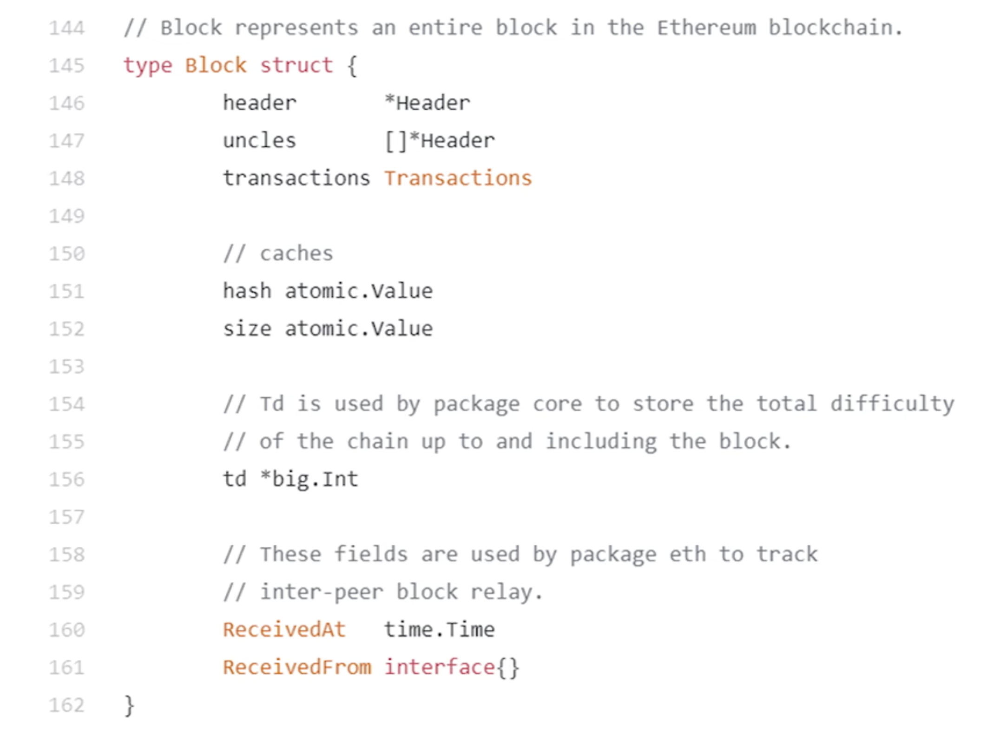
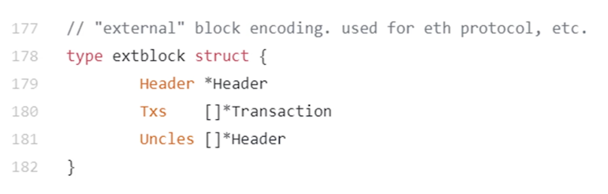

# 从账户地址到账户状态的映射
ETH的账户地址是160bits，一般表示为40个16进制数字。

## 参考方案一
使用hash表实现，可以维护地址到状态的映射，查询起来很方便。

如果需要提供Merkle proof，比如你想和一个人签合约，需要证明他有多少钱。可以实现的方式是将hash表内容组织成Merkle tree。但会有一个问题，就是新交易产生后，必然会导致hash表内容变化，进而引起Merkle root hash值发生变化。而我们做Merkle proof时，无法感知到这个变化。而且每次需要重新构建Merkle tree。

> BTC中构建Merkle tree时，是发布后不会再更改的。所以不会有这个问题。

这里ETH的场景，需要把所有ETH系统的账户，构建为一个Merkle tree。数量很大，且产生新区块时要遍历所有账户。

## 参考方案二
抛弃hash表，直接使用Merkle tree。这样做有两个问题：
1. Merkle tree没有一个高效的查找方法，每次做修改时很难。
2. 是否对底层节点做排序？不排序的话，无法做证否，即无法证明某个交易不在区块里。而且叶子结点顺序不一致，会导致root hash值变化。

所以我们需要一个排序Merkle tree，但每次新产生的账户，地址都是随机的，可能会插入到序列中间任意位置，此时后面的所有节点对应的子tree都要更新重构。

所以我们得出结论，参考方案一和二都无法满足要求。
## ETH实现
以太坊使用的是MTP，Merkle patricia tree。
### Trie
一种前缀树或者叫字典树。如下图所示：

所以一颗表示英文单词的字段树，每个层级最多的分叉数是26，再加一个终止标记，总共最多27个分叉子树。

按照开头说的，ETH账户地址是由40个16进制数字构成，所以
1. 分叉因子（branch factor）个数是17个
2. 树的高度统一都是40

Trie优点：
1. 不会出现碰撞，只要地址不一样，一定最终分支不同
2. 账户插入树的顺序，不影响最终树的结构
3. 更新操作局部性非常好

缺点：
1. 一脉单传的场景，存在存储浪费。可以合并这些节点，成为路径压缩前缀树。

这样树高度大大降低，访问内存的次数也减少了，提高了效率。
如果此时加入了geometry，会让左边的分支扩展开。
路径压缩在树的键值分布比较稀疏时，效果比较好。用英文单词举例子，就是单词长度比较长，但总数量不多。
ETH的地址空间是2的160次方，足够稀疏，且位数很长，所以适用于这种压缩场景。
2. 结合merkle tree的特性，每个节点指向子树的hash。这样就可以得到一个root hash值。

BTC系统中有一个merkle tree，就是每个区块中包含的交易信息。
ETH系统里有三个merkle tree，其中一个也是交易树，另一个就是现在讨论的账户状态信息构成的merkle tree，叫做状态树。

### 状态树
状态树的root hash作用：
1. 防篡改，防止账户信息被非法修改
2. merkle proof，能证明账户余额信息。全节点将账户所在的分支全链路发给轻节点，轻节点就可以验证
3. 可以证明某个账户不存在

ETH使用的MPT，是修改版的MPT，Modified MPT。

上图是一个示例，可以看到ETH系统中，有三类node：
1. extension node
2. branch node
3. leaf node

左上角是四个地址。
首先第一层节点是root节点，类型为extension。内容是a7，即经过压缩后的路径。next node指向下一个节点的hash地址。如果路径上出现了压缩，就会写进extension node里。
第二层有多个分叉，所以是branch类型。
第三层第一个节点是叶子结点，类型leaf，表示到这里地址就结束了。

### 修改
状态树修改时，不是新建一个完整的树，而是在原来的基础上作修改。

上图是两个区块的例子，state root是状态树的根。左边是前一个区块，右边是新的区块。
可以看到虽然每个区块有自己的状态树，但树的大部分节点是共享的，右边的树只有发生改变的节点，需要新建分支。
右边的树其中的一个合约账户（有code和storage）发生了改变，其中的存储发生变化。注意合约账户的storage存储也使用的MPT结构，维护变量到变量取值的KV映射。合约账户的Nonce和Balance发生了变化，但是代码没有改变。存储树大部分节点没有改变，只有一个整数变量取值由29变为45。
ETH系统新的区块生成时，采用新建树的方式来保存改动，而不是在原有基础上作修改。这样做的原因主要是什么？

ETH系统由于调整出块时间为10几秒，所以发生分叉是很常见的。

如上图所示，下面的区块需要回滚到上一个区块的状态，从而按照另一个分叉去继续挖。要实现回滚操作，就需要历史的状态记录。
这与BTC是不同的，BTC的交易模型是转账，这种回滚操作很简单，只需要反向执行一笔就可以。但ETH中有智能合约，无法通过合约的执行结果，推算出执行前的状态。所以需要保存完整的历史状态以支持合约的回滚。

# 代码数据结构
## Block Header

- parentHash 前一个区块的header hash
- uncleHash 叔父区块的header hash
- coinbase 挖出本区块的矿工地址
- root 状态树的root hash指针
- txHash 交易树的root hash指针，类似BTC区块中的root hash
- receiptHash 收据树的root hash指针
- bloom 过滤器，和receiptHash相关，提供高效的查询符合某种条件交易的执行结果
- difficulty 挖矿难度
- gasLimit 智能合约需要消耗gas，类似于BTC的交易手续费
- gasUsed
- time 区块产生的时间
- extra
- MixDigest 由nonce经过计算得到的hash
- Nonce 挖矿时猜的随机数

## Block

- header 指向上节里所讲的block header的指针
- uncles 指向叔父区块header的指针数组
- transaction 区块的交易列表

ETH区块真正在晚上发布时，信息主要就包含上面三项。

# 状态树保存数据的方法
状态树保存的是(key, value)，key就是地址，上面大篇幅讲的是地址的管理方式。
而value的保存，是要经过RLP编码做序列化，之后再存储。
> RLP: Recursive Length Prefix

RLP只支持nested array of bytes这一种类型数据。