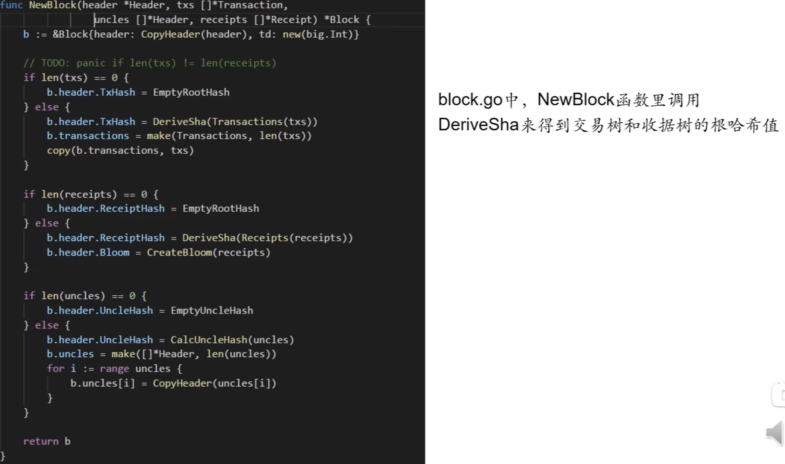

ETH中，每次发布一个区块，区块里的交易会组织成一颗交易树，也是merkle tree，和BTC类似。同时ETH还增加了收据树，每个交易执行完后会形成一个收据，记录交易的相关信息。交易树和收据树的节点是一一对应的。
创建收据树，是考虑到ETH中的智能合约执行过程比较复杂，所以通过增加收据树结构，有利于快速查询执行结果。

交易树和收据树都是MPT，但是和BTC中的不完全一样。为什么这里三种树都统一使用MPT？肖臻老师的推测是为了代码编写方便。

这三棵树的主要区别：
1. 交易树和收据树都是只把当前区块里包含的交易信息组织起来的，而状态树是把系统中所有账户的状态都要包含进去。
2. 不同区块的状态树是共享节点的，每次新区块只创建有修改的地址信息，并生成子树，其他没有变化的信息，还会共享之前区块的树节点。但每个区块的交易树和收据树是独立的，不会共享节点。

# 作用
提供merkle proof：可以证明某个交易被打包到某个区块，和证明某个交易的执行结果。

此外ETH还支持比较复杂的查询，比如过去10天内，某个智能合约发生的所有交易，例如众筹、发行新币。
针对这种需求，ETH提供了bloom filter，即布隆过滤器。
> 布隆过滤器：对一组集合，将每个元素通过hash函数映射到一个有限范围的向量上，得到这个集合的digest。之后当到来一个元素时，同样用hash函数计算，在向量上查找对应的位是否为1，否的话说明这个元素一定不在集合内，是的话说明元素大概率（可能有hash碰撞）在集合内。
> 局限性：不支持删除操作。

ETH使用bloom filter的目的是什么？
ETH每个交易执行完成后，会包含一个bloom filter，记录了交易的类型，地址等信息。发布的区块在header里，也有一个总的bloom filter，这里面的内容，是区块里所有交易的bloom filter并集。

那么查找过去10天内，某个智能合约发生的所有交易，过程就是：
1. 查找到哪个区块header的bloom filter，包含了该交易的类型
2. 如果header中没有，则说明这个区块不是我们要找的
3. 如果header中bloom filter命中，再去查找内部交易收据树，每个收据的bloom filter，看看哪个有
4. 如果有，则可以找到对应的交易进行确认。

这个好处是可以通过bloom filter，快速过滤掉大量无关的区块。

# 交易驱动的状态机
ETH的运行过程可以看做交易驱动的状态机（transaction-driven state machine）
状态是所有账户，在状态树中的状态。交易是每次发布的区块中包含的交易。通过执行交易，会驱动系统从当前状态，转移到下一个状态。
> BTC也可以认为是交易驱动的状态机，状态是UTXO。
> BTC和ETH的状态机相同之处是，状态转移都是确定性的。一组给定的交易，能够确定性的转移到下一个状态，因为所有的全节点都要执行这些交易。

Q: ETH的状态树，能否只包含这个参与了这个区块所记录的交易的相关账户状态？
A: 1. 这样子做会导致查找某个账户的状态很不方便，而ETH是基于账户余额的状态模型，当发起交易时，就需要花费大量时间查找账户的状态。2. 当一个新账户要交易，因为之前从来没有过交易，所以没有任何区块记录过他的状态，按照部分记录的模式，节点做验证就需要向前遍历所有区块，才能确认账户的状态。

# 代码中的数据结构
## 区块中的交易树和收据树
整体代码流程：

交易树的代码如下：

首先判断交易列表是否为空，为空的话，header里的交易树roothash就是一个emptyroothash值。否则计算出交易树的roothash，然后创建出区块的交易列表。

中间这部分是收据树：

同样也先判断收据列表是否为空，空则赋值给收据树roothash一个emptyroothash。否则计算出收据树roothash，然后创建header里的bloom filter。

这里交易列表的长度和收据列表的长度应该是一样的。

最后是处理叔父区块的代码（和ghost协议相关）：

先判断叔父列表是否为空，否则计算叔父列表root hash，然后通过循环遍历叔父列表，构建出区块里的叔父数组。

### DeriveSha函数

这里创建的数据结构，是一个Trie类型，它的源码如下：

而trie是一个MPT。
所以ETH中的三棵树，用的都是MPT。

### Reciept结构

每个交易执行完后，都会形成一个reciept。
51行的Bloom就是bloom filter。Logs是一个数组，每个收据可以包含多个log，bloom filter就是根据log产生的。

### 区块header

区块块头的数据结构如上图，77行是一个bloom filter，整个区块的bloom filter合并得到的。

### CreateBloom函数

参数是区块的所有收据，for循环对每个收据调用LogsBloom函数，得到每个收据的bloom filter，然后通过Or操作合并起来，得到整个区块的bloom filter。

LogsBloom作用是得到每个收据的bloom filter，入参是这个收据的log数组。函数有两层循环，外层循环遍历每个log，对log地址调用bloom9函数来取hash，加入到bloom filter中，内层循环对这个log的每个topic取hash再加入到bloom filter中。这样就得到了收据的bloom filter。

### BloomLookUp函数

查询bloom filter中是否包含像查找的元素