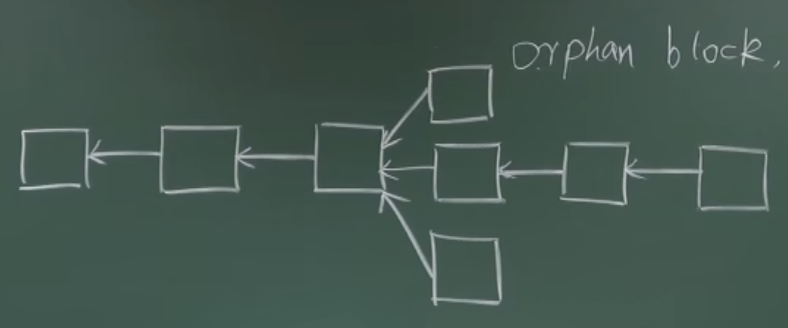
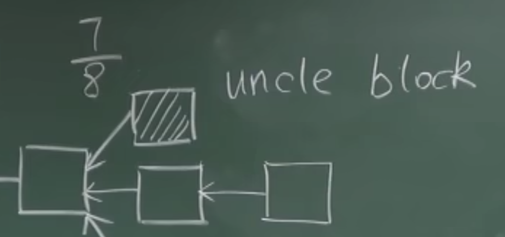
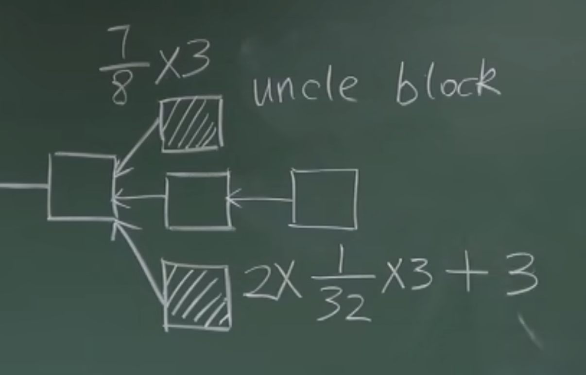
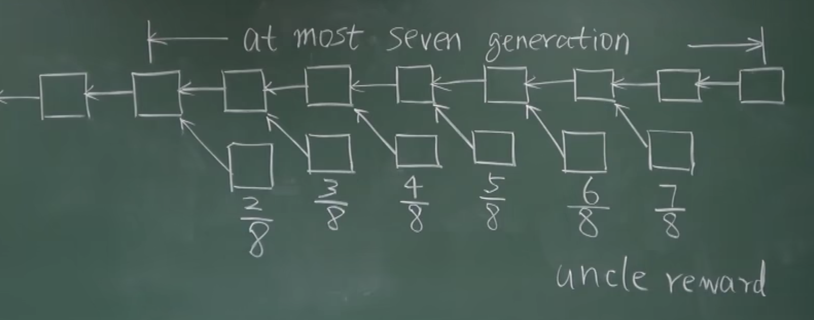

ETH的临时分叉会更多，是常态。

# 对共识协议的挑战
BTC只有最长合法链上的出块奖励是有效的，其他被丢弃的区块，没有任何奖励。

BTC网络中出现临时分叉的情况比较少，所以这种规定是可以接受的。

但对于ETH来说，意味着矿工挖到的区块很大概率是白挖了，因为系统中分叉很多。而且这种情况对于矿池这种形式，会很占便宜。

ETH为了避免这种情况，采用了Ghost协议作为共识协议。
对于orphan block，ETH对它起了另外一个名字，uncle block。最长合法链上的区块生成时，可以把他的叔父区块包含进来，这样叔父区块可以得到八分之七的出块奖励。

如果区块包含了叔父区块，可以获得额外的三十二分之一的出块奖励。每个区块可以最多包含uncle block。

这种方式有利于鼓励系统中出现分叉时，及时进行合并。

## 缺陷

1. 一个区块最多可以包含两个uncle block，当出现第三个区块时怎么处理？
2. 有的矿池出于商业竞争的考量，故意不包含别的叔父区块。

区块在产生无论多少代之后，仍然可以包含最初的叔父区块，即叔父区块没有辈分之分。
这样，在一条链上，即使这次不包含，后续被其他矿工挖到的区块，还是有可能会包含这批叔父区块进去。 
如果有这种情况，就是一个节点在ETH网络最初挖矿难度很低的时候，产生大量叔父区块，期待着被之后的区块包含进去，怎么办？

ETH规定，只有往前6代内的叔父区块可以获得奖励，且奖励逐渐递减。如上图所示，从7/8一直衰减到2/8。

这样做的好处有：
1. 全节点无需维护大量的7代前叔父区块信息
2. 有利于鼓励尽早合并分叉

局限性和问题：
1. 对于硬分叉，即对现有区块链协议版本认可有分歧，导致的分叉，无法解决。
2. 和BTC类似，矿工的奖励来源于两部分，一是block reward，二是交易时的手续费，BTC系统里叫做transaction fee，ETH称之为gas fee。执行智能合约时会消耗gas fee。uncle block只能获得最多7/8的出块奖励，而gas fee是得不到的。（但问题不大，目前这部分奖励比例非常小，1%）
3. 叔父区块中的交易是否执行？不会被执行，因为可能和最长合法链上的交易有冲突。叔父区块只被当作一个提供奖励的凭证，只检查是否是一个合法发布的区块。不会检查其中包含的交易是否合法。
4. 假如叔父区块之后还有区块，如何处理？只有第一个区块会获得叔父区块奖励。这样子可以鼓励及时合并分叉，而且避免出现分叉攻击成本降低的问题。