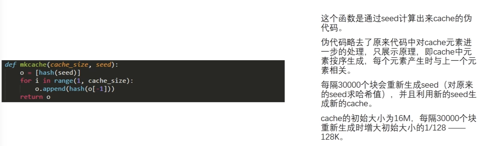
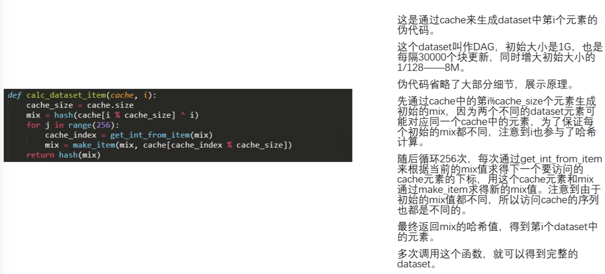
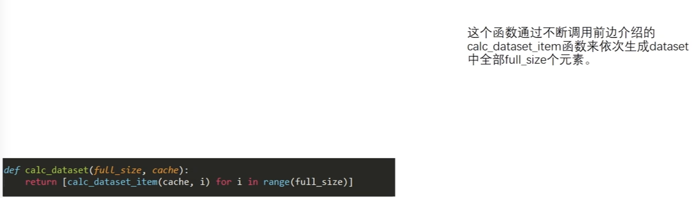
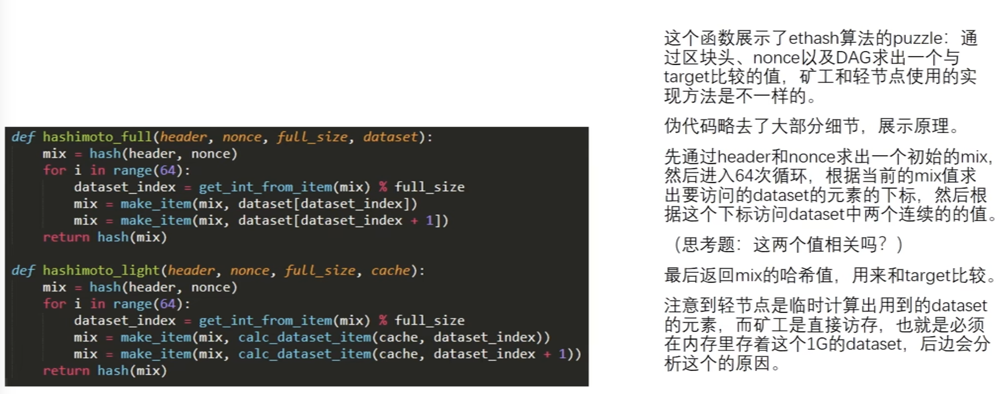
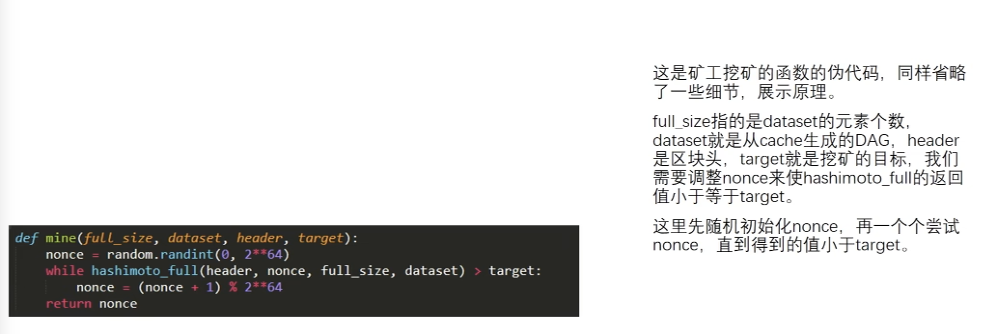
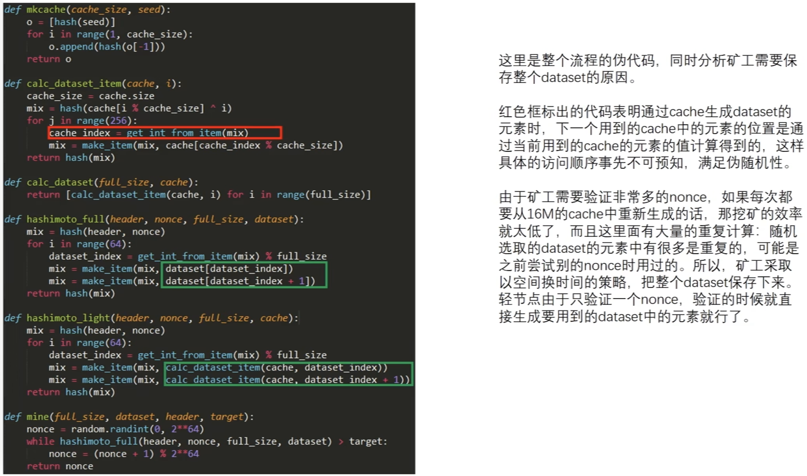
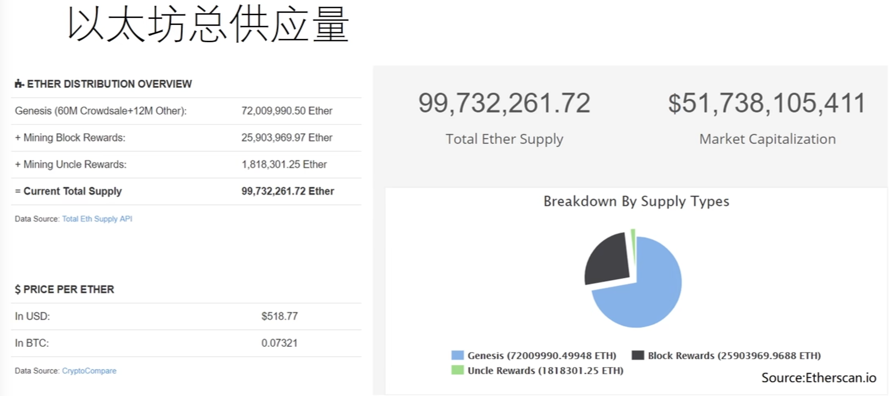

# BTC的挖矿算法

对于基于工作量证明的区块链系统，挖矿是保证区块链安全的重要手段。
> Blockchain is secured by mining

BTC的挖矿算法是比较成功的，经受住了时间的考验。但是存在着一个问题，就是挖矿设备的专业化。这与BTC系统最初设计理念相悖。
> 中本聪的论文里有一个说法叫做One CPU, one vote。理想状况下应该让普通老百姓，通过自己的个人PC，笔记本甚至手机，参与到挖矿中。这样也更安全，因为算力分散，恶意攻击者获得51%算力的难度更大。

后续的虚拟货币设计挖矿算法时，一个目标就是ASIC Resistance。
那么如何设计出这样的挖矿算法呢？

# Memory hard mining puzzle

增加对内存访问的需求，达到Memory hard mining puzzle。因为ASIC芯片对于通用PC的主要优势是计算能力更强，但内存访问性能上没有很大优势。

这方面一个早期的例子是莱特币，LiteCoin。它曾是市值仅次于BTC的第二大加密货币，使用的puzzle是sCrypt这种Hash函数，对内存要求很高。其具体设计思想是：
1. 开设一个很大的数组，第一个数是seed，后面的每一个数都是前一个位置的数取Hash得到的。求解puzzle时按照伪随机顺序读取一些数，每次读取的位置也是和前一个位置相关的。例如下图所示。

先读取A位置的数，根据取值进行一些运算，得到下一次读取的位置B，然后读取出B的数，进行运算后，得到C的位置。
这样做的好处是，如果数组开的足够大，对于挖矿的矿工来说就是Memory hard。如果有的矿工不保存整个数组，那么每次计算时都需要从seed开始一直算到要访问的那个位置，会大幅提高挖矿难度。
但是也有的矿工会选择保存一部分数组，比如只保存奇数位置的数组，每次用到偶数时通过奇数的值来推算，这样能节省一半的空间。这种方式叫做time-memory trade off。

这种算法的好处是对于矿工来说，是memory hard的puzzle。但坏处是对于轻节点来说，也是memory hard。

之前讲过，puzzle的设计原则是求解很难，但验证容易。这个算法的问题是，验证puzzle所需要的内存空间，和求解所需要的空间基本一样。

实际litecoin设计的数组只有128KB，为了照顾轻节点。最后的效果是当初发行时，目标不仅是ASIC Resistance，而且是GPU Resistance。大家都用普通的CPU挖矿就行了。结果是最后还是出现了用GPU挖矿，和ASIC芯片挖矿。实践证明，128KB的数组设置，不足以对ASIC芯片矿机带来实质上的障碍。
所以从这点来说litecoin的设计目标并未实现，但他的这种理念吸引了很多矿工参与进来，帮助解决了冷启动问题。

除了mining puzzle之外，litecoin和btc的出块速度也不同，litecoin每2.5min产出一个区块。除了这些，这两个加密货币基本一致。

# ETH的解决方案

ETH也采用了一种memory hard mining puzzle，但设计上和litecoin区别很大。

ETH采用了两个数据集，一大一小。
1. 小的是16M的cache
2. 大的是1G的dataset，也叫DAG

1G的数据集是从16M的cache生成出的。这么设计的原因是便于验证，轻节点只需要保留16M的cache即可，只有需要挖矿的矿工才保存1G的dataset。

## 基本思想

小的16M缓存的生成方式，和LiteCoin的数据集生成方式比较类似：
1. 首先从一个seed节点，经过运算算出数组第一个元素，然后依次取hash，将数组从前到后填充成伪随机数，得到一个Cache。
2. 之后和LiteCoin不同，LiteCoin是直接从数组中按照伪随机顺序读取一些数进行运算。ETH是先生成一个更大的数组，即dataset。其中的元素都是按照伪随机顺序，从小Cache里读取一些元素，方法和LiteCoin求解puzzle类似。例如第一次从A位置读取，之后对hash值进行更新迭代，算出下一个位置B，继续更新hash，算出C的位置。总共进行256次计算，最后算出的数放进dataset第一个位置。之后以此类推，dataset每个元素都是从cache里按照伪随机顺序不断进行迭代更新，最后得出一个hash值存入。
最后求解puzzle时，使用的是dataset里的数据，不用cache。按照伪随机顺序，从dataset读取128个数。一开始根据block header和nonce值，算出初始的hash，映射到数据集的一个位置，然后取出值以及相邻的一个位置的值，进行运算，得到下一个位置。总共进行64次循环，每次读两个值，总共128个数。最后算出hash，和挖矿target比较。符合即挖矿成功，失败则替换nonce，继续下一轮计算。
> 大小两个数据集会按照时间变化而增大，目前dataset已经是2.5G了

## 伪代码实现

第一步：

第二步：

调用第二步的逻辑：

矿工的挖矿函数与轻节点验证函数：

每次相邻的两个元素，是不相关的。虽然位置上相邻，每个都是由Cache中的256个数生成的，且位置由伪随机产生。这样每个元素独立生成，为轻节点验证提供方便。
轻节点验证函数里，full_size和挖矿函数里的full_size相同，都是dataset的长度，不是cache的长度。
轻节点验证时，每次循环都会通过cache推算出对应index的dataset值。

矿工挖矿的函数：

nonce的取值范围是0-2^64

所有函数的汇总：

## 效果

目前ETH挖矿大多数采用的是GPU，做到了ASIC Resistance。这与ETH挖矿使用的Ethash算法需要消耗大内存分不开。

另外ETH很早就开始计划从PoW转向PoS，所以这种消息也对要做ASIC矿机的厂商产生制止作用。

## Pre-mining
ETH采用了预挖矿，ETH在发行货币时，预留了一部分ETH货币给ETH开发者。就像创业公司预留期权给创始团队。

## Pre-sale
开发阶段，将一部分虚拟货币出售，换取资金支持项目的继续开发。

# 统计数据

别的省略，视频录的太早，现在的数据已经变很多了。
