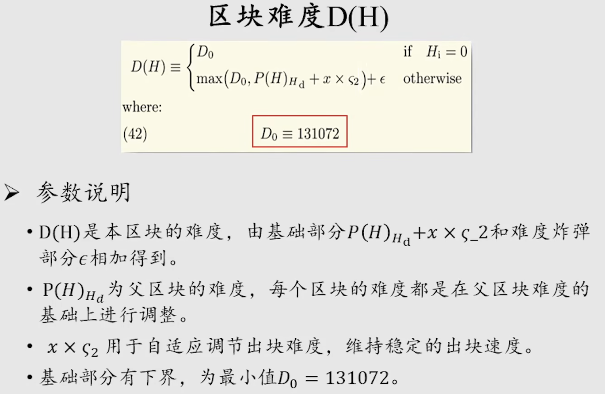
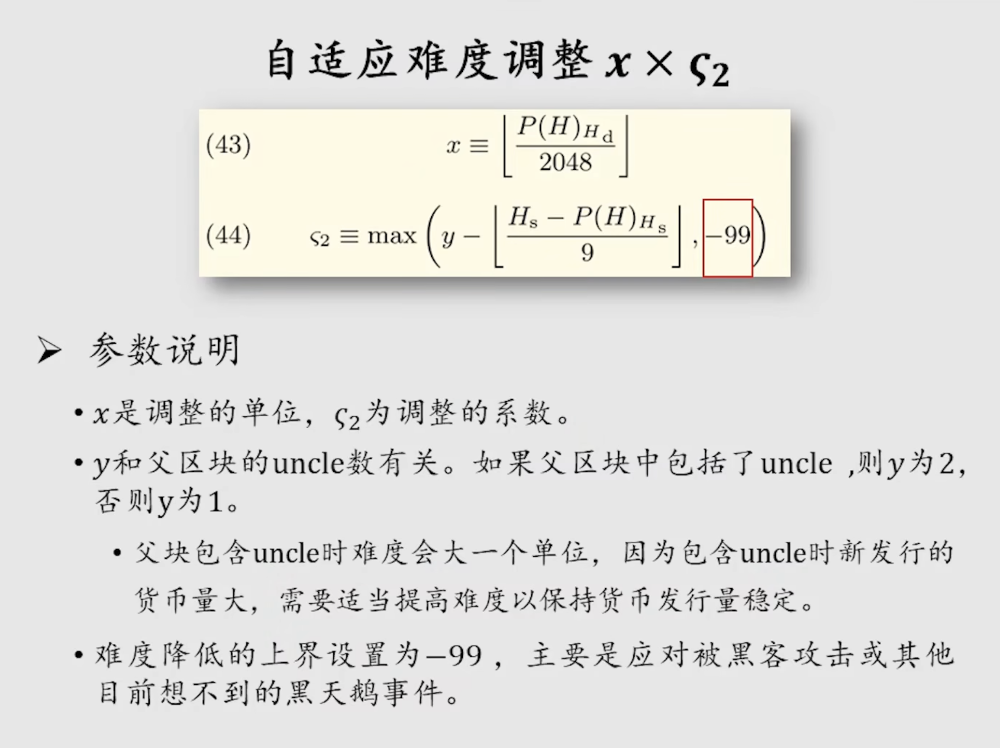
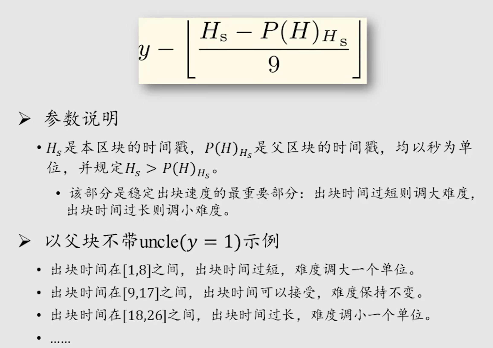
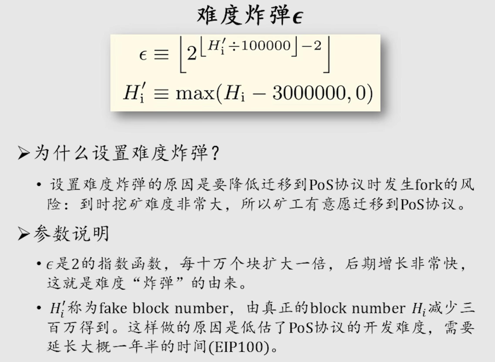
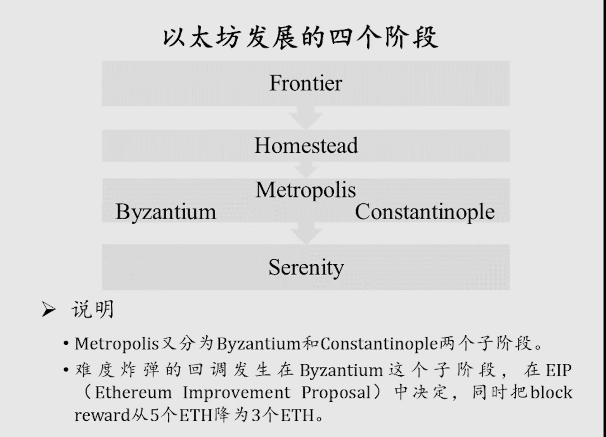

BTC每隔2016个区块调整一次挖矿难度，目标是维持出块时间为平均10min。
ETH是每个区块都有可能调整挖矿难度，方法也比较复杂，且改过几个版本。目标是维持平均出块时间15s左右。
# 调整算法

D0是为了保证ETH挖矿有一个最低难度的下限。

调整难度的粒度是2048，即按照父区块难度的1/2048为调整的单位。

目前（2018年）正处在Byzantium阶段。

其他内容先跳过吧，这部分比较抽象，后面需要用到了再回来细听。