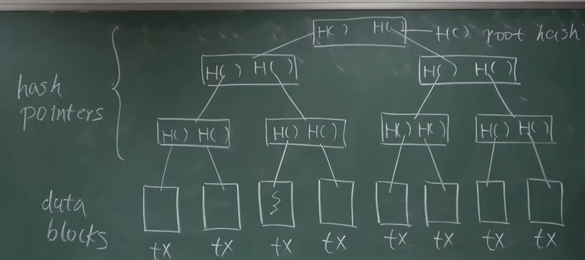
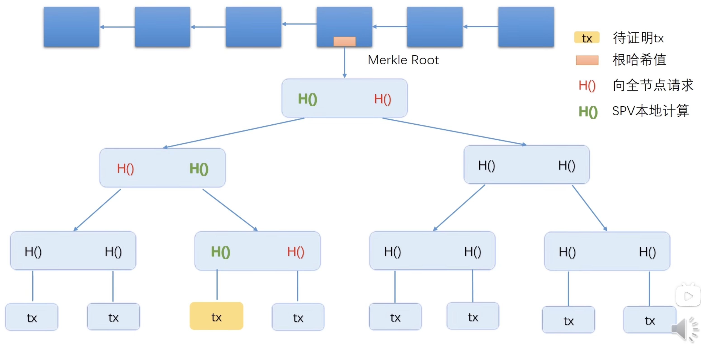
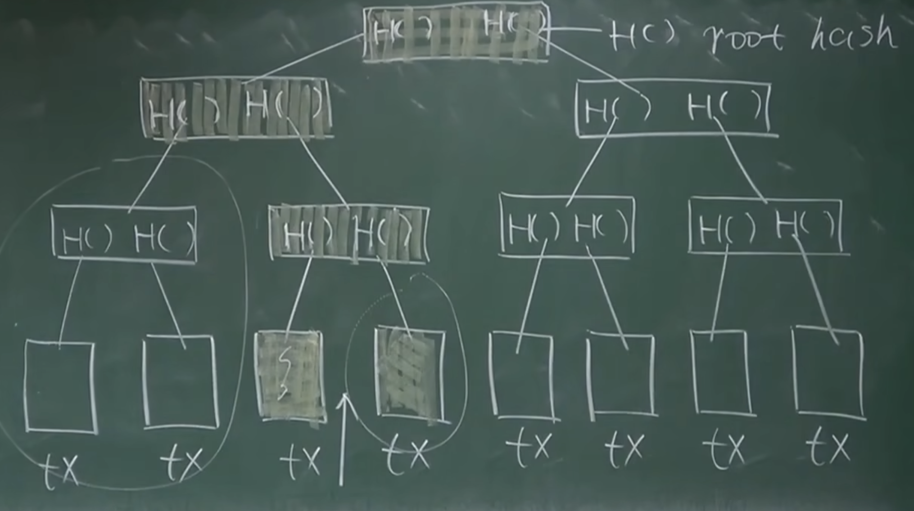

区块链：与普通链表的区别是，使用hash指针代替了普通指针

# Tamper-evident log

链表中第一个区块成为创始区块，genesis block。最后一个区块成为most recent block。

每隔区块都有一个指向前一个区块的hash指针。

When calculating HASH for one block, it will use whole block data. Once a block is tampered by someone, the next block's hash pointer will change, otherwise the chain will be broken. To keep the chain continious, someone has to change next block's hash pointer.

This will lead to that, the most recent block's pointer's value will differ with other blocks in blockchain.

Using this feature, some protocols dont need to save all blocks in one chain, but just the most recent block. People can easily find any tampered chain in the network.

# Merkle tree

二叉树形式，父节点的左右指针，是hash指针，是由对应的子树经过hash后算得的。

与bin tree的区别：

1.  指针为hash指针。replace normal pointer with hash pointer

每个区块里包含两部分：
1. block header
    a. including root merkle hash value of the merkle tree
2. block body
    a. full transaction detail list(organized as a merkle tree)
## 用途
### merkle proof(proof of membership/proof of inclusion)
There are two kinds of block node in BTC:
    1. full node(全节点): saving all block content, including header and body
    2. light node(轻节点): such as BTC wallet app in mobile phone. Only saving block header.
    > Q: How to prove the transaction has been writen into block chain to a light node?
    > A: Using merkle proof.

如下图所示，最上面一行是一个小型区块链，并展示出其中一个node的merkle tree。最下面是里面包含的交易，展示出其中一个node的merkle tree。

需要为一个轻节点，证明黄色标出的这个交易，是属于这个区块链的。步骤如下：
1. 由于轻节点没有保存交易的具体内容（交易列表，merkle tree），所以只有一个body header，保存着merkle tree的root hash value
2. 轻节点向网络中的某个全节点，请求merkle proof
3. 全节点将上图网络中，标为红色的三个Hash value发给轻节点
4. 轻节点拿到红色的hash value后，先进行第一级的计算：拿黄色交易tx的hash，和第一级红色的hash值，算出上一级的绿色hash值
5. 再用算出的绿色hash，和第二级红色hash，算出更上一级的绿色hash
6. 以此类推，最终算得merkle tree的root hash value。与自己header中保存的hash value进行比对。一致则证明成功，黄色交易在merkle tree中。不一致则证明失败

上面的例子里存在一个问题，就是提供merkle proof的全节点，有可能会构造出一组错误的红色hash值，但保证最终算出的root hash值保持不变。这样就可以伪造一比交易。
这种场景是人为制造hash碰撞。在之前的密码学中讲过，BTC的hash有collision resistance性质，可以保证不会被造出这种场景。所以不存在这类问题。

merkle proof的时间复杂度是O(log(n))
merkle proof of non-menbership的时间复杂度？
1. 如果排列顺序无序，则遍历所有叶子节点，复杂度为O(n)
2. 可以对交易列表，按照hash排序，则时间复杂度也是log(n)
示意图如下：

这种排好序的merkle tree，称作sorted merkle tree。BTC中没有采用这种数据结构，因为没有证否的需求。

Hash指针的结构，可以用在哪里？
无环的结构都可以。有环的结构会存在循环依赖的问题。