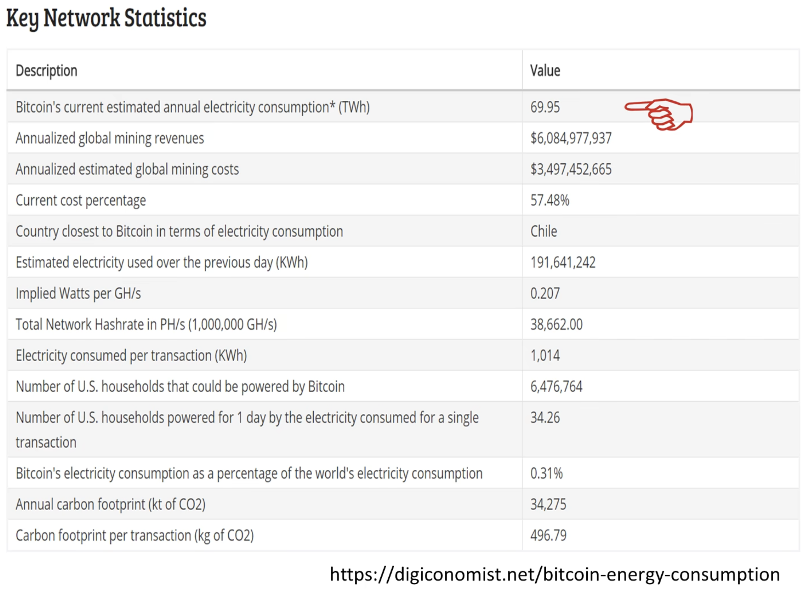
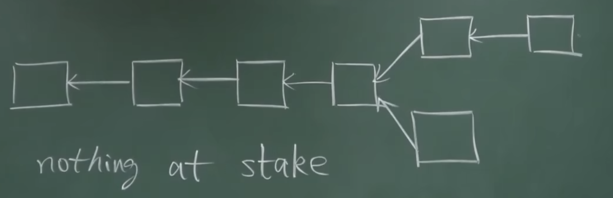
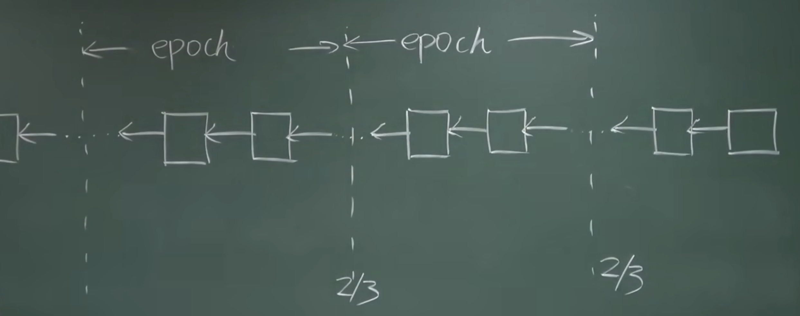

# PoW的缺陷

PoW普遍被诟病能好过高

## BTC统计数据

上图Y轴是瓦数，单位是TWh（10^12瓦时）
下图是具体的统计数据

## ETH统计数据

ETH的能耗比BTC低很多，主要原因是出块时间短。

## 矿工挖矿的目的

矿工挖矿是为了获得记账权，获得出块奖励。
矿工能否挖到区块，根本决定因素还是矿工投入多少资金来购买挖矿设备，获得多少算力。与其这样，不如将这些钱投入到区块链的开发，将来获得更多的收益。
上述所讲就是PoS的理论基础，也叫做Virtual Mining。

这种方法明显的好处是省去挖矿过程，避免了对环境的影响，减少碳排放。

## PoS的好处
维护PoW的区块链安全性不是闭环。新的币，在发行早期，采用PoW很容易被攻击。

对于PoS的区块链，如果有人要发动攻击，必然要大量买入货币，这样开发者或早期投资者可以从中获利。这个过程是闭环的。

PoS和PoW不是互斥的，有的加密货币，采用的是，矿工持有的币越多，挖矿难度越小。这样做会引入一个问题，持有越多货币的矿工，挖矿难度就越小。

可以采用锁定货币的方法，当矿工使用一定的货币来降低挖矿难度，区块链在挖矿成功后，会锁定这部分币一段时间，在他挖下一个区块时无法使用这部分币。等待若干的区块之后，才能继续使用它。
这种方式也叫Proof of Deposit。

# PoS面临的挑战

如上图所示，有的矿工会在两个分叉上两头下注，在下面质押的币，如果上面的链成为最长合法链，则不会收到任何影响和锁定。

# ETH采用的PoS协议

Casper the Friendly Finality Gadget.

Casper协议引入了验证者Validator的机制。想要成为Validator，必须投入一定数量的ETH作为保证金，被系统锁定。
Validator作用是推动系统达成共识，投票决定哪条链是最长合法链，投票的权重取决于投入保证金的大小。

具体做法类似于数据库中事务。
挖矿时，两种共识机制混用阶段，每100个block作为一个epoch，决定它能否成为finality（最终确定，不会被回滚和修改的）要进行投票。投票采用two-phase commit。

第一轮投票：prepare message
第二轮投票：commit message

Casper规定每一轮投票都要得到2/3以上验证者才能通过，这是按照保证金额大小来计算的。

实际系统中，不再区分两轮message，而且将epoch由100个区块减少为50个。每次进行一轮投票，这次投票相当于上一轮的commit message，下一轮的prepare message。连续两轮投票，两个epoch都得到2/3的多数票，才算有效。

验证参与过程中，可以得到相应的奖励，类似矿工的出块奖励。
相反如果验证者有不良行为，会收到惩罚。比如不作为，该投票时不去投票，结果导致系统迟迟无法达成共识，会扣除一部分保证金。如果验证者乱作为，乱投票，为两个有冲突的区块都投票，则会被没收全部保证金。被没收的保证金会被销毁掉，相当于减少了ETH系统中币的总量。

每个验证者有一定的任期，每个任期满后，会有一个等待期，这个期间别的节点可以检举揭发验证者有无不良行为。如果等待期过了，没有任何不良行为，则验证者可以取回当初的保证金，以及验证奖励。

## finality有没有可能被推翻

单独矿工是无法推翻finality的记录，如果想要推翻，必须有validator作为同伙。

出现攻击成功的情况：
1. 有大量validator两边下注，给前后有冲突的finality都投票。
2. 这部分验证者至少有1/3

这种情况一旦发现，1/3这部分验证者的保证金将会被没收。

ETH的设想是从PoW过度到PoS，随着时间推移，挖矿奖励越来越少，投票奖励越来越多。

# 为什么ETH不从一开始就用PoS

因为PoS不很成熟。PoW经过了Bug bounty的检验，没有很严重的漏洞。
EOS刚刚上线（2018年），没有采用PoW，而是DPoS（Delegated Proof of Stake）协议。
先用投票的方式选出21个超级节点，然后由这些超级节点产生区块。