# 什么是智能合约

- 智能合约本质是运行在以太坊区块链上的一段代码，代码的逻辑定义了智能合约的内容。
- 智能合约的账户保存了当前合约的运行状态
    - balance：当前余额
    - nonce：交易次数
    - code：合约代码
    - storage：存储，数据结构是一颗MPT
- solidity是智能合约最常用的语言，语法和js接近

# 智能合约的代码结构
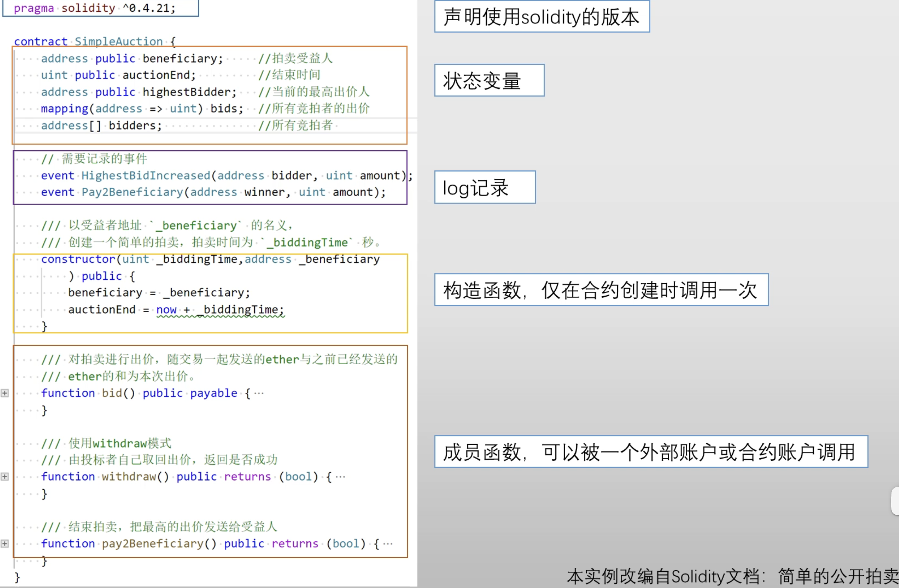

solidity的hashmap不支持遍历，如果想遍历所有元素，自己需要记录hashmap中的key，这里用了bidders数组。

solidity的构造函数只有在合约创建时被调用，只能有一个构造函数。

# 调用智能合约的方法

## 外部账户调用合约

调用智能合约，和转账类似。A发起交易，转账给B：
1. 如果B是普通账户，则是普通转账交易，类似BTC
2. 如果B是合约账户，则是发起了一次合约调用，具体调用的函数会在data域说明
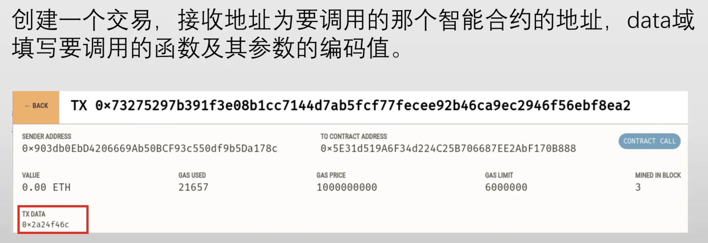

## 合约之间调用

### 直接调用
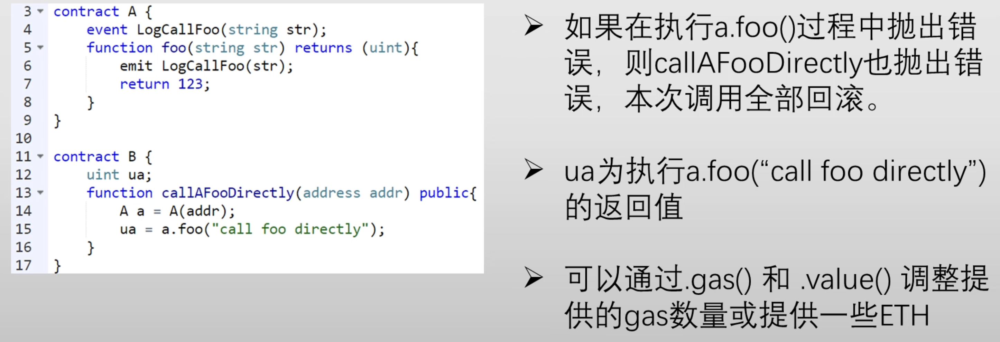

ETH规定，交易只有外部账户才能发起，合约账户无法发起。所以上面例子需要有一个外部账户调用B合约，B合约才能调用A合约的foo函数。

### 使用地址类型
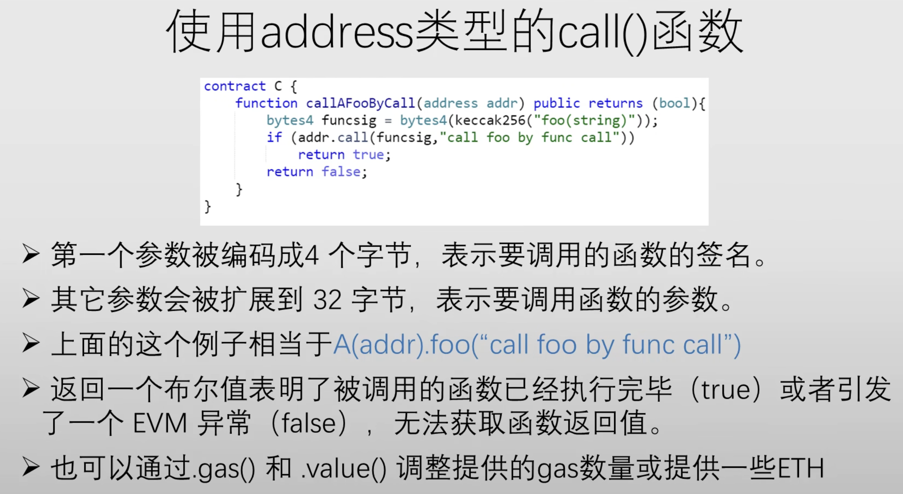

addr是A合约的地址，call函数第一个参数是被调用函数的签名，后面是调用的参数。

这种调用方法和上面直接调用的区别是：
1. 错误处理方式不同：
    a. 直接调用时如果被调用合约A处理时抛出异常，会导致调用方B也出错异常。而call调用时，被调用合约抛异常，call函数会返回false，而不会抛出异常。

### 代理调用delegatecall()
不需要切换到被调用合约的环境中执行，而是直接在当前合约环境中执行。
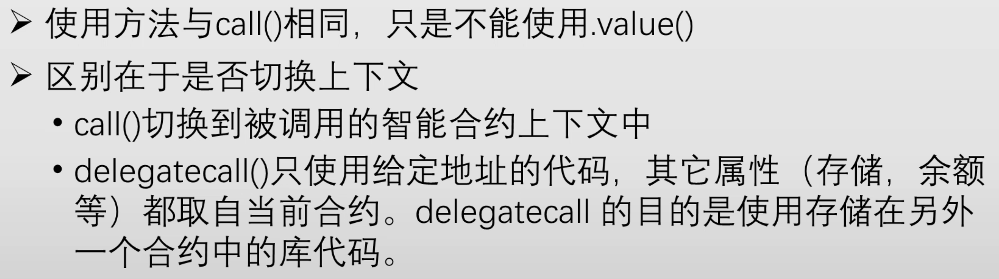

## payable
ETH规定，如果合约账户要能接受外部转账的话，需要有payable标注的function。这里的bid函数是用来竞拍出价的。bid函数接受外部转账，并锁定这部分ETH币。

拍卖结束后，没有赢得竞拍的账户，调用withdraw函数，将锁定的币取回来。

对没有标注payable的函数，转去value的话，会抛出异常。

## fallback函数
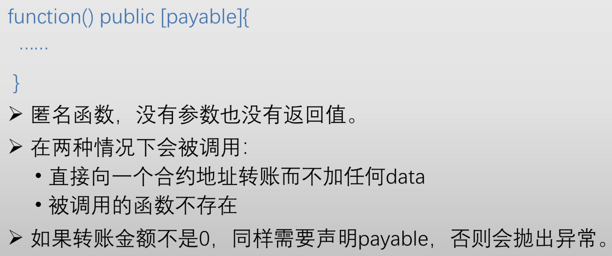

1. 调用合约时，传入的data域是空的，就会调用fallback函数
2. data域中的函数不存在，也会调用fallback函数

fallback也可以标注payable，一般都会标注为payable。因为其他人发起交易，data域为空，且进行一笔转账，就会引发一场。

# 智能合约的创建和运行
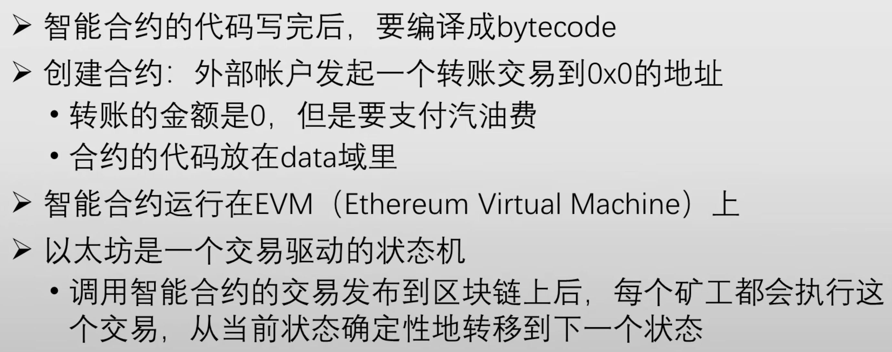

# Gas fee
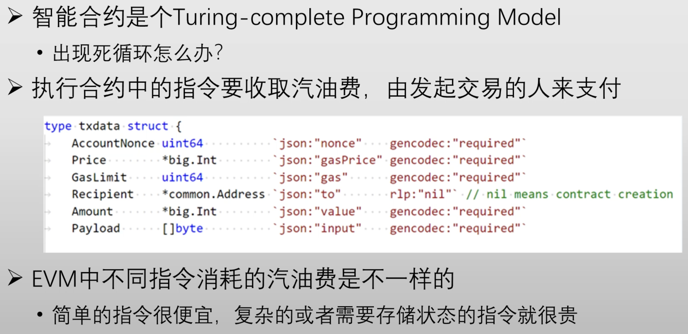

solidity设计是图灵完备的，功能相比BTC脚本要强大得多。

当一个全节点收到智能合约的调用，怎么知道会不会引起死循环？
答案是没有办法知道，这是一个halting problem停机问题（非NPC的）。
ETH解决方法是推给发起交易的账户，由他支付汽油费。

# 错误处理

- 智能合约中不存在自定义的try-catch结构
- 一旦遇到异常，除特殊情况外，本次执行的操作全部回滚
- 可以抛出错误的语句：
    - assert(bool condition): 如果条件不满足就抛出——用于内部错误
    - require(bool condition): 如果条件不满足就抛掉——用于输入或外部组件的错误
    - revert(): 终止运行并回滚状态变动

不论是普通转账还是智能合约，都按照上面准则执行。

出现错误的情况，出了上面给出的三种代码中语句外，还有：
1. 汽油费：如果交易执行完，没有达到当初的gaslimit，多余的gas fee会退回账户，用了多少gas fee就收多少，多余的退回。相反如果gaslimit都用完了，合约还未执行完，需要回滚回开始执行之前的状态，这是一种错误处理，此时已经消耗的gas fee不会退回。这种方式为了防止DoS攻击，有恶意攻击者不断发起消耗很大的交易。

# 嵌套调用

# ETH Block Header
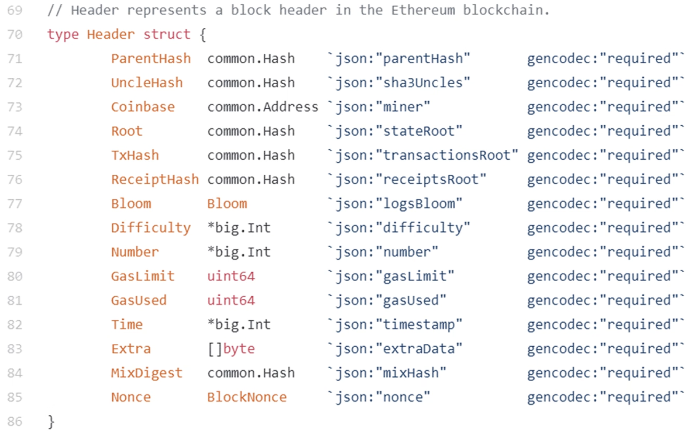

上面的gas limit和gas used都是和gas fee相关。
1. gas used是指这个区块里所有交易消耗的gas fee加在一起
2. gas limit，区块链对发布的区块都有一定限制，BTC中是大小1M的限制。ETH因为智能合约的存在，不能简单对大小进行限制，所以使用gas limit，作为一个区块中所有交易能够消耗的gas fee的上限。__每个矿工在实际挖矿时，可以根据上一个区块的limit大小，进行微调，单位是1/1024__

# Receipt数据结构

假设某一个全节点要打包交易到区块中，这些交易里有一些是智能合约的调用，那么是应该先执行全部智能合约，再去挖矿，还是先挖矿，再去执行智能合约？
先执行智能合约，因为执行智能合约后，区块链的三颗MPT可能会发生变化。进而导致header的hash变化，挖矿无效。

当全节点收到一次合约调用时，要先一次性把可能花掉的最大gas fee从发起账户上扣掉。扣除的过程是什么？
收取gas fee时，只需要从本地的状态树中，对应账户的账户余额，减掉即可。
receipt也是一颗MPT树，与状态树、交易树一样，属于全节点本地维护的数据结构。

是否有矿工，对于不是自己挖出来的区块，由于没有gas fee，所以不进行验证。
不会，因为跳过这一步，本地的三棵树内容无法更新，挖出的新区块，别的节点无法验证，之后就不会获得出块奖励了。

发布到区块上的交易，是不是都是成功执行的？如果智能合约执行过程中出错，要不要也发布到区块链上？
出错的交易也要发布到区块链上，因为执行时扣除了gas fee。

怎么判断交易是否执行成功？
根据receipt。

## 数据结构
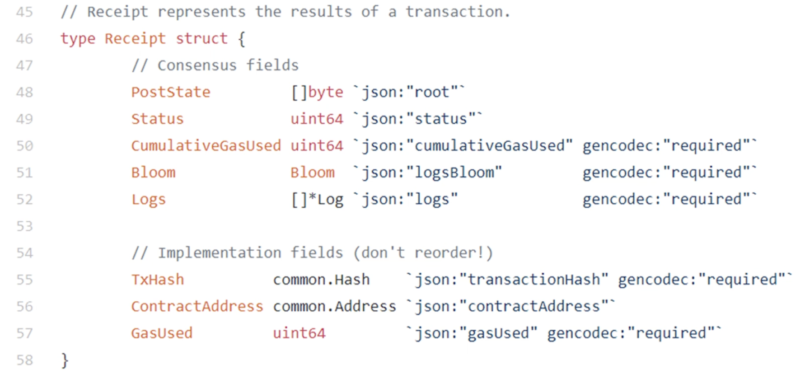

status域可以表示交易执行的结果

智能合约是否是多线程的？
solidity不支持多线程，原因是给定一个智能合约，面对同一组输入，它转移到的下一个状态必须是确定的。因为需要多个节点来验证。
多线程的问题是多个核对内存访问顺序，可能不同，会导致不同的结果。此外还有产生随机数时，可能会导致不一致问题。（这块没明白老师的意思）

## 智能合约可以获得的区块信息
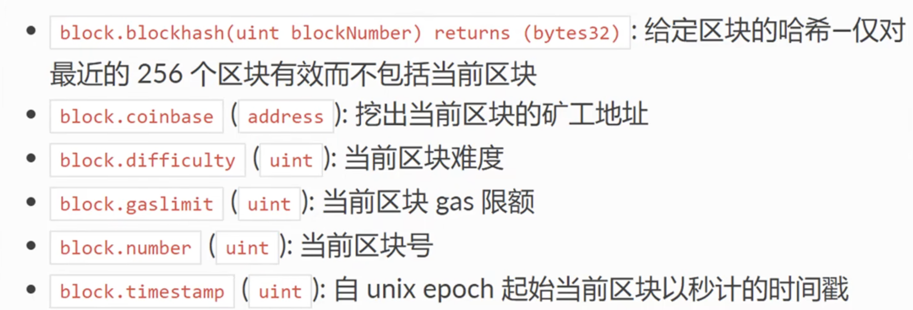

## 智能合约可以获得的调用信息
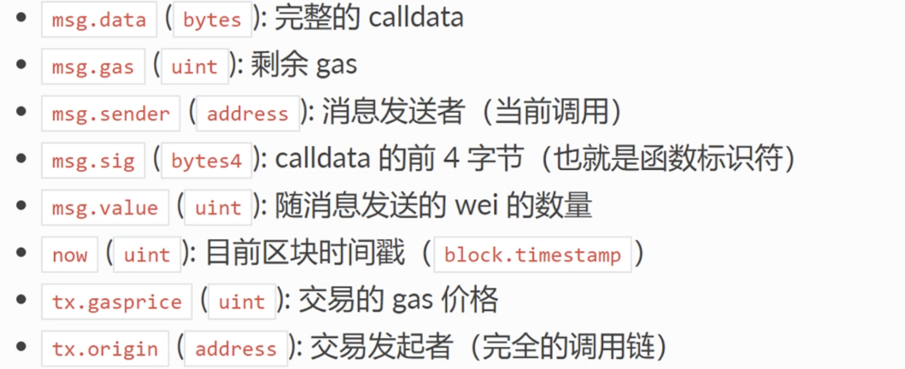

注意msg.sender和tx.origin可能是不一样的，因为会存在合约调用合约的情况。

## 智能合约可以获得的区块信息
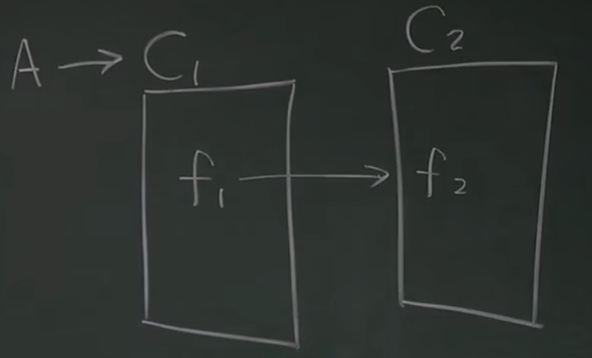

如上图，对于C2来说，msg.sender是C1，而tx.origin是A。

## 智能合约的地址类型
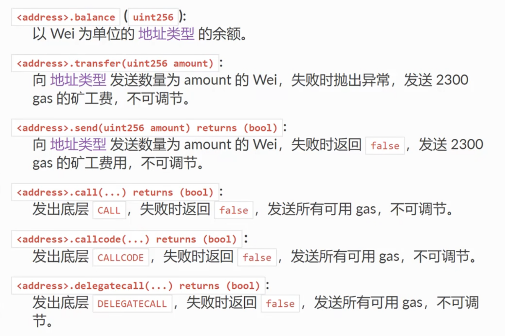
所有智能合约均可显式地转换成地址类型，需要注意这些成员函数的语义和直观的理解有一些不一样。
例如address.transfer(12345)，这个调用是向address这个地址的账户，转了12345Wei。address.call调用时，是当前的合约，发起的调用，调用了address这个合约的某个方法。
transfer和send区别是，transfer会抛出异常，导致连锁性回滚。send失败会返回false，不会直接触发回滚。
call.value(uint256)也可以转账，不会引起连锁回滚，失败返回false。

# 简单拍卖
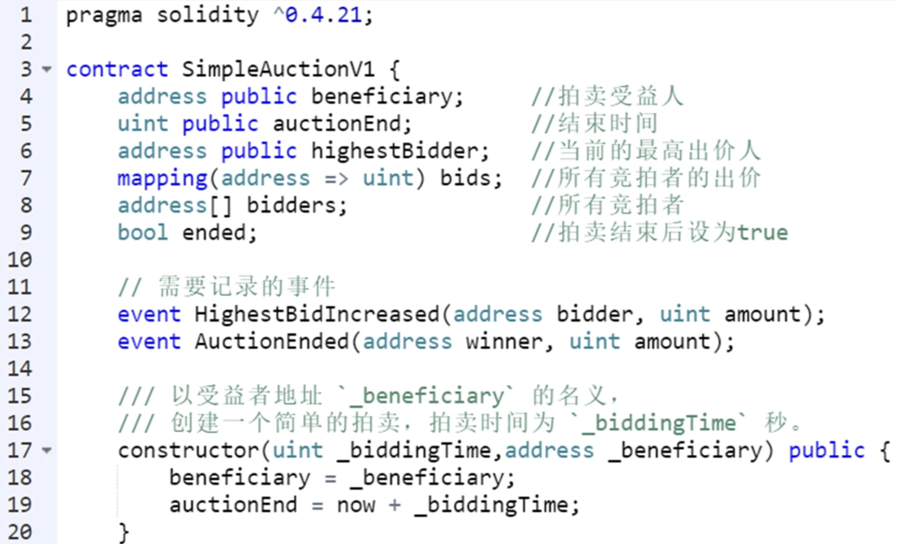

## 竞价函数
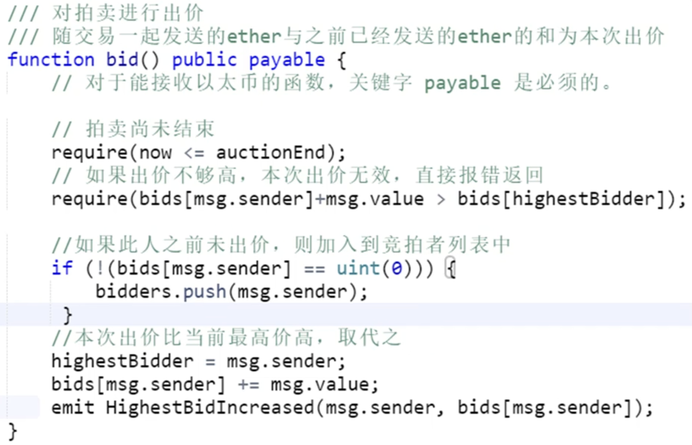
竞拍函数没有参数，因为发起调用方，需要在msg.value字段里带上出价，相当于发起一笔转账。

## 结束拍卖函数
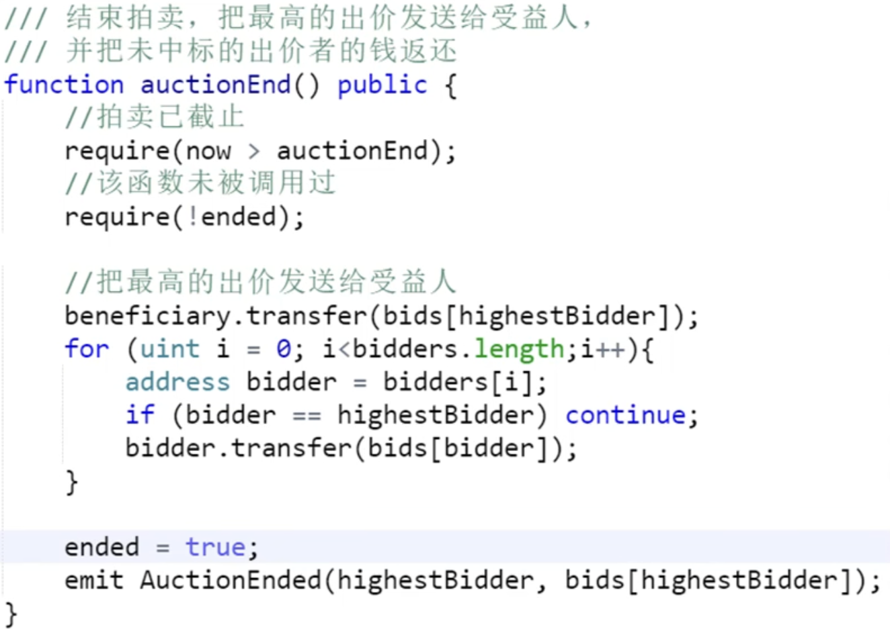
没有竞拍成功的出价人，会收到退款。

## 代码存在的问题
假设有一个人通过如下合约账户参与竞拍，会有什么问题？
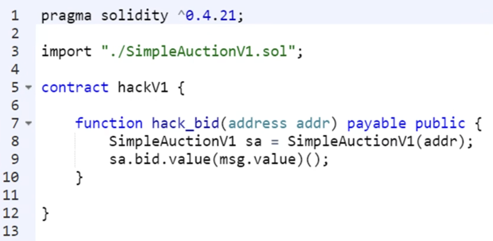

合约没有写fallback函数，会导致退款失败，执行时回滚，导致拍卖合约无法退款和转款给受益人。这样会导致钱在合约中，永远无法取出。

> Code is Law，智能合约的规则是由代码决定的，一旦发布代码，永远无法更改。

智能合约如果设计有漏洞，会导致ETH币永远被锁住，谁也无法取出来。

之前有一种方法，使用智能合约锁仓，比如一个项目开始初期，给大家一笔钱，将其存在一个合约里，三年后取出来。这种方式类似于**不可撤销信托**。

能否给合约里留个后门，让owner用户，可以进行任意转账？
技术上可行，但存在信任问题和中心化问题。

# 改进版拍卖合约
改进版由投标者自己取回出价。

## withdraw函数
每个投标者自己取回钱款
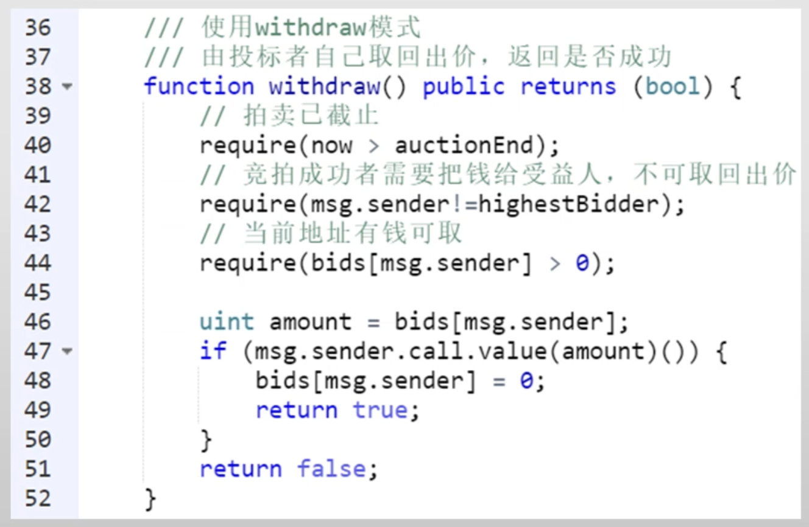

## 受益人提款函数
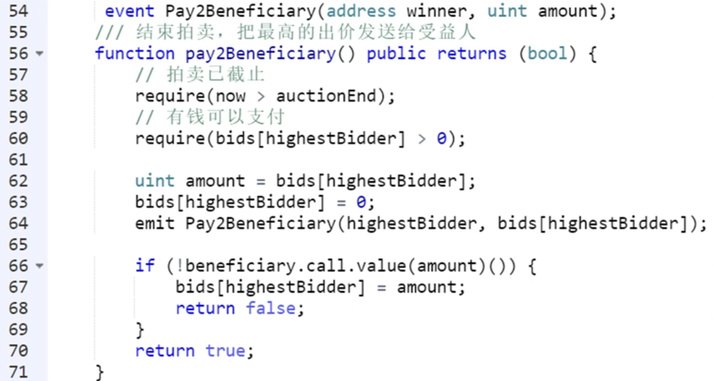

先判断条件，再改变条件，最后再和别的合约交互。属于经典的合约交互模式。

## 问题
存在重入攻击风险
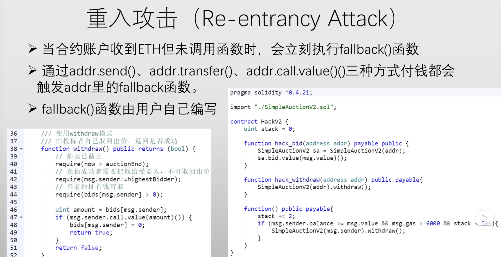

1. 黑客发起withdraw，拍卖合约执行
2. 拍卖合约向黑客合约转账，但是调用到了黑客合约的fallback函数
3. 黑客合约的fallback函数里，又调用了拍卖合约的withdraw方法
4. 此时48行的清零永远不会被执行，因为合约已经陷入到了两边的递归调用过程
5. 每次调用withdraw方法，都会从拍卖合约的总balance（存放所有竞拍者的出价）中，转amount的ETH币给黑客合约。
5. 递归调用持续到以下三种情况会退出：
    1. 拍卖合约余额不足
    2. 拍卖合约付不起gas fee
    3. 调用栈溢出

# 第二版改进版拍卖合约

## 改进版

修改前：
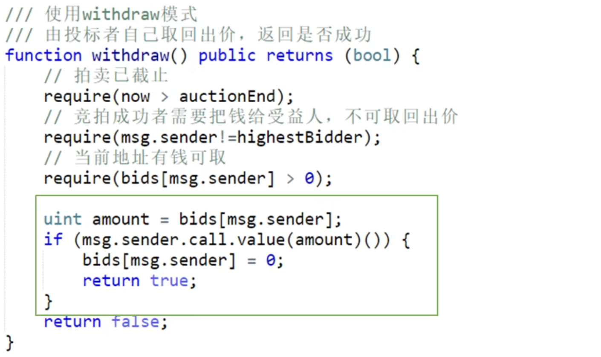

修改后：
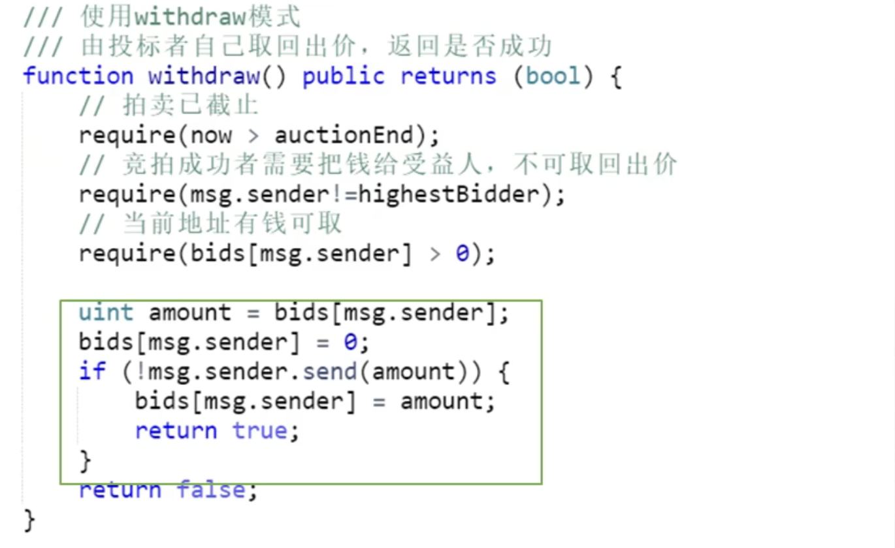

使用send方法代替call，这样gas fee只有2300Wei，不足以支持对方进行一笔新的调用。