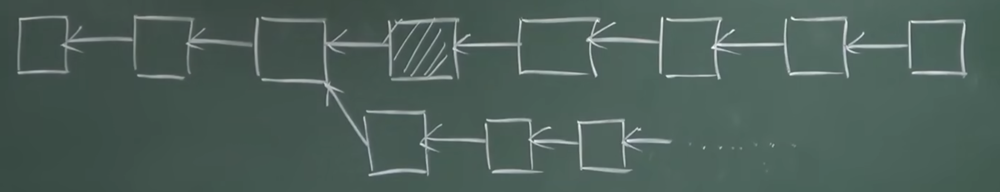

# 造成ETH分裂的事件

DAO: Decentralized Autonomous Organization，去中心化的自治组织，建立在代码机制上

2016年出现了The DAO组织。其工作方式类似DAC。每个成员提供一定的ETH，加入组织，这个组织根据投票结果，决定投资哪个项目。投票是按照投资数额加权计算。

DAC: Decentralized Autonomous Cooperation，去中心化的自治公司

The DAO在2015年开始众筹，被称为伟大的尝试，引起社区很大的关注。一个月筹集到了价值当时1.5E美元的ETH。

但这个组织只存在了三个月，因为投资者取回收益出现了比较大问题。当投资人需要取回收益时，需要通过拆分的方案取回，称为split DAO。这个拆分的方案也是用来建立子基金child DAO的方法。

如果有一小部分人，投资理念和其他人不同，也可以通过拆分的方式成立子基金。此时这部分人在The DAO的代币会换回ETH，然后他们就可以拿着这些ETH投资自己想投的项目。

child DAO最少可以一个人成立，这个人可以选择把ETH投资给自己，就相当于取回了收益。这和之前讨论过的拍卖合约不同，没有withdraw方法。

拆分时，有7天的辩论期。拆分之后，ETH币有28天的锁定期。

这个制度本身没有任何问题，而且是民主制度的一个很好的体现，民主并不是少数绝对服从多数，而是少数也可以通过民主的方式，自决一些东西。

但是问题出在了splitDAO的实现上：

代码里先通过withdrawRewardFor函数进行了转账，然后清零余额。这和上节重入攻击的情形一样，正确的做法应该是先清零，再转账。

黑客就是利用这个漏洞，进行了重入攻击。最终转走了1/3的ETH。

ETH社区进行了讨论，一部分人认为需要回滚交易，对28天锁定期内的资金进行挽救。另一部分人认为不需要补救，因为黑客行为没有违法。规则是由代码决定的。ETH的开发团队V神那拨人，是支持回滚的，主要理由是影响面太大，TheDAO这个智能合约资金已经站了ETH整个10%的比例。

# 补救方法
从发生攻击之前的区块开始分叉，是否可行？

这样会有一个问题，就是不只是黑客攻击的交易回滚，其他合法交易也会被回滚。会导致大量问题。

所以要精确定位到黑客攻击的交易，而不影响其他合法交易。
ETH团队设计了两个步骤：

1. 锁定黑客账户
2. 设法将黑客盗取的ETH退回去

ETH发布了一个软件升级，增加一条规则：凡是和TheDAO合约账户相关的，不允许做任何交易。发布之后大多数ETH矿工都升级了这个软件。
> 这是一种软分叉，增加了一条规则。这时新矿工挖出的区块，旧矿工是认可的，因为旧矿工不知道这个规则。但是旧矿工挖的区块，新矿工有可能不会认可，因为有可能包含了TheDAO相关的交易。

这个方案本身是好的，但是存在一个Bug，和Gas Fee相关的。当新矿工执行到了和TheDAO相关的交易时，认定其非法，此时是否还需要收取gas fee？

ETH的升级，没有收取gas fee。此时ETH网络上出现了大量的黑客DoS攻击，发起TheDAO相关的交易。导致很多矿工回滚了版本，退回了升级前的软件。

此时，距离28天锁定期的时间已经不多了。ETH决定设计硬分叉的方案：

1. 通过软件升级的方式，将TheDAO上的资金，全部转到另一个智能合约上。这个合约只有一个功能，就是退钱。将TheDAO代币换回ETH并退还给投资人。

> 这种做法的本质是用软件升级方法，强行重新记账。交易原本是需要有合法的签名做验证，此时不管同意与否，都把TheDAO账上的资金强行转到新的合约上

新的软件上规定了强制执行的时机：挖到第192W个区块的时候。所有升级了软件的矿工，在第192W个区块时，立即进行转账。

ETH社区对硬分叉方案反应很大，一部分人认为这种方式违背了去中心化。两派争论很激烈，最终决定使用智能合约进行投票。

最终结果是大部分人支持硬分叉，大多数矿工也升级了新的硬分叉版本软件。

最终硬分叉成功了，黑客盗取ETH行为没能获利。

# 故事的结局
当初反对硬分叉的人，并没有因为投票结果而改变立场。他们认为投票参与的人不够多，而且投票并不能说明问题，大多数人的意见不一定对。

硬分叉之后，旧链没有消亡，而是继续在挖，只不过算力降到了不足原来的1/10。但是好处是挖矿难度大幅度降低。仍然有一部分矿工留在了旧链上挖。

一段时间后，有的交易所开始上市交易旧链上的ETH，将其命名为ETC，Ethereum Classic。刚上市时，人们对旧链ETC能存活多久持观望态度。但是最终，ETC存活到了现在。

最初这两条链上的区块是高度一致的，存在着重放攻击的可能性。后来人们给链上加了chainID，用以区分。现在已经是两条分开的链了。

现在交易所上，两种以太币都在正常交易，而且旧链的算力已经比刚刚硬分叉时，提高了很多倍。

# 思考
不论是软分叉还是硬分叉，都是将锁定黑客盗币的账户做为目的。但讲到解决方案时，是把TheDAO所有账户做为目标，例如软分叉里所有账户都不能交易，硬分叉里所有账户都要将ETH转入新合约。

为什么不能只针对黑客的账户？

因为不知道黑客具体账户是哪些，这次是黑客利用bug，下次可能是别人进行攻击。