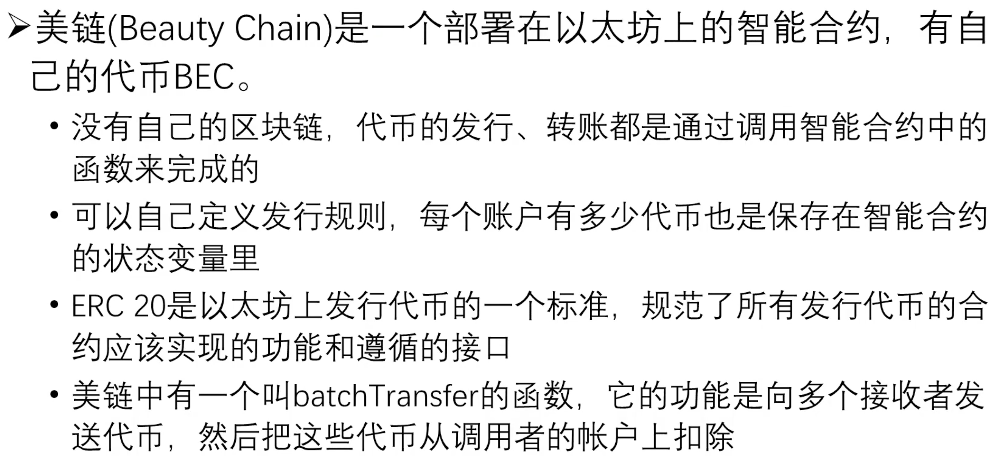
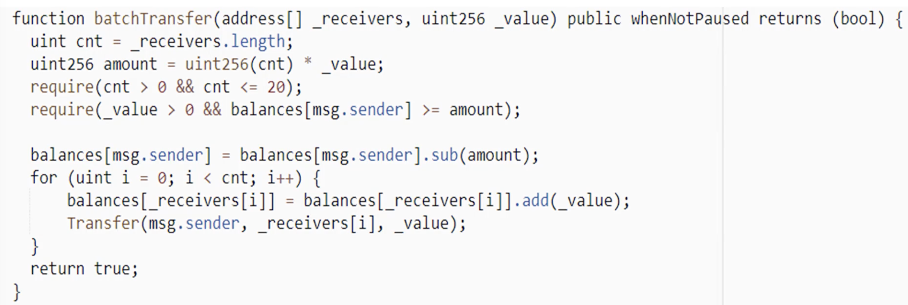
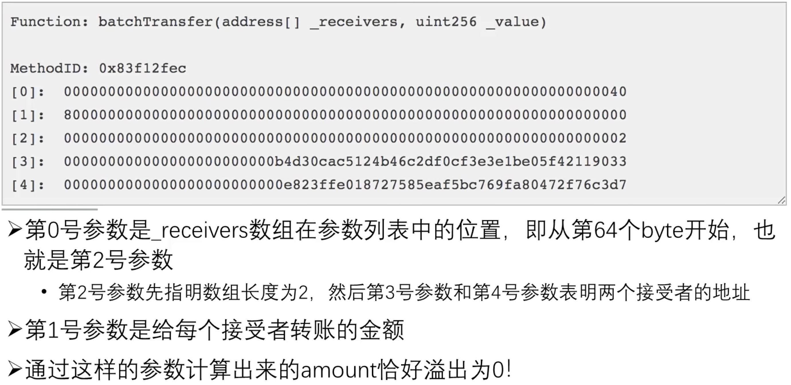
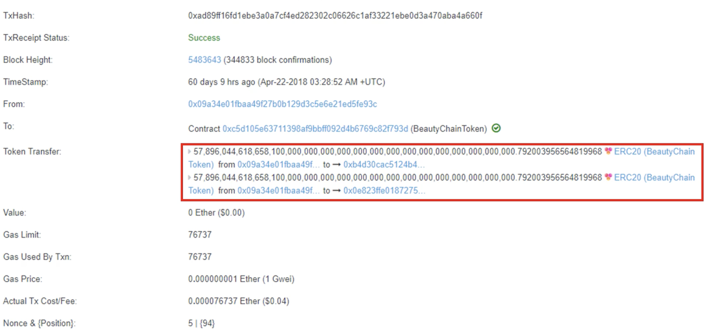
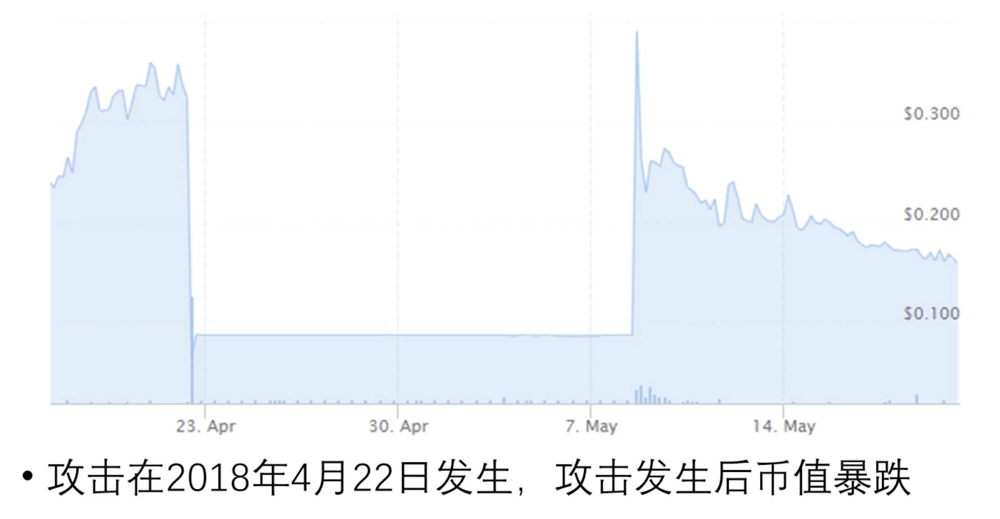
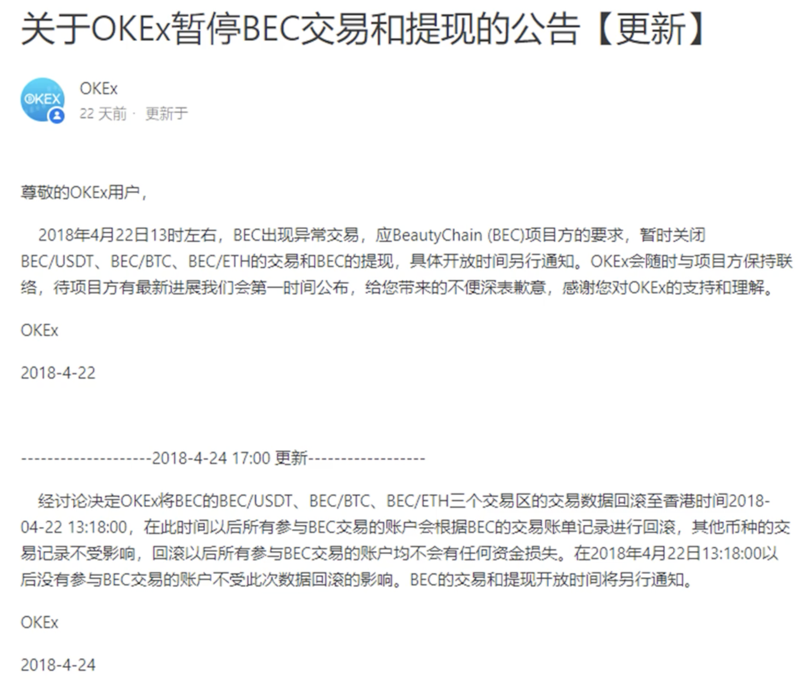
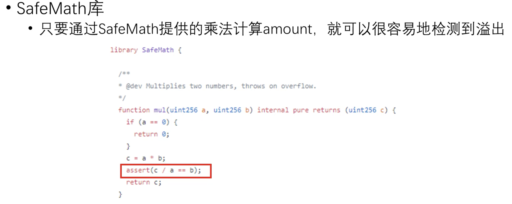

# 最新的安全漏洞例子
出问题的合约称为美链Beauty Chain。

美链是一种运行在ETH的智能合约，有自己的代币BEC。

> ERC: Ethereum Request for Comments

batchTransfer函数的实现如下：


这个合约代码问题出在
``` solidity
uint256 amount = uint256(cnt) * _value;
```
如果_value值传入的是一个很大的值，经过乘法计算后，可能会溢出，amount结果是一个很小的值。

此时从发送者账户里减去的amount，和接收者账户上增加的_value，就不是相同的值。

# 攻击的细节




红框里是发生攻击时，两个接受的地址。每个地址都收到了数额很大的代币。

# 攻击结果

之后交易所发布了公告


# 反思
进行数学运算时一定要考虑溢出的可能性，solidity里有SafeMath库，可以检测溢出的场景：

