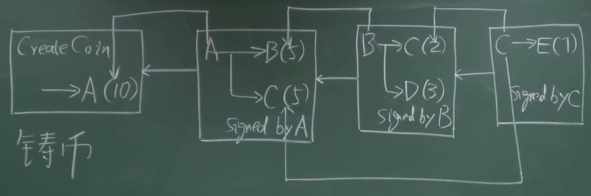
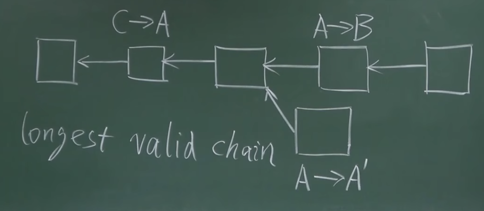

# 中心化的缺陷
假设现在央行要发行数字货币：
1. 创建一对公私钥的密钥对
2. 向社会公开公钥，所有人可以获取
3. 发行新的货币时，使用私钥加密货币
4. 普通人拿到货币时，进行交易，交易双方可以通过公钥验证货币的真实性

整个过程看起来没问题。

但实质上存在复制的可能性。货币没法被普通人伪造，但是文件可以被无限复制。这个特性叫做**double spending attack**，也叫**双花攻击**。

> 数组货币的主要挑战，就是防范double spending attack。

改进一下上面的方案，央行给每个发行的数字货币，分配一个唯一编号。并维护一个DB，记录每个数字货币，在谁的手上。
每当进行交易时，交易方核实央行的数字签名后，向央行确认一下，这个货币是不是在付款方。是的话，这比支付就是合法的。

上面这种机制，可以防范double spending attack。实践中也可以这么用，但是缺点是中心化，太麻烦，任何两人之间进行支付都要通过央行。

# 去中心化的方案
去中心化方案存在两个问题：
1. 数字货币的发行：谁有权利发行数字货币。挖矿
2. 怎么验证交易的有效性，防止双花

针对第二个问题，比特币有一个类似于上面例子里，央行所维护的交易记录表。但这个表是由所有用户共同维护的。
这个数据结构，就是区块链。

1. 发行10个比特币，给A。这个交易称为**铸币交易**
2. A将这比比特币，分成两个部分，5个给B，5个给C。交易需要A进行签名。并说明10个比特币的来源
3. B将5个比特币，其中两个转给C，3个转给D。交易由B进行签名
4. C决定将7个比特币给E

以上过程就构成了一个小型区块链。
这里有两种hash指针，一种是之前讲的每个区块之间连接的hash指针，将区块连接成链表。
另一种则是指向前面某个交易的hash指针，用来说明币的来源，证明钱不是凭空捏造的，是有记录的，防范双花。

在发起一笔转账时，例如A向B转5个BTC，站在交易双方的角度看，需要以下信息：
1. 对A来说，需要知道B的公钥。公钥即地址，就像银行卡号一样，有了它才能进行准确的转账
2. 对B来说，需要知道A的公钥。因为需要用公钥解密，验证A的签名是否正确。这里需要注意的是，因为比特币是分布式记账，全网所有节点都要对这笔交易进行验证，所以A的公钥需要广播出来。

那么问题来了，怎么能知道A的公钥？
每个交易包括输入和输出两部分。A的公钥是由交易时携带的输入信息告知的。交易时除了携带币的来源信息外，还要说明自己的公钥是什么。

如果B节点是一个恶意节点，想通过伪造交易的方式，偷走A的钱该怎么办？
1. B的同伙伪造了另一个节点B1，使用自己的公私钥，并伪装成A节点，将BTC转给了B
2. 此时交易携带的BTC来源信息，会指向coinbase交易。但是coinbase交易里记录的转给A的地址，和B1的地址是不匹配的
3. 所以这笔交易会被验证为不合法

## 再说数据结构
一个区块的组成是由block header和block body组成的。
1. block header
    a. version
    b. hash pointer to prev block header
    c. merkle root hash
    d. target
    e. nonce

挖矿时求的就是H(block header) <= target
需要注意，hash pointer算的hash值，是针对header算的。

2. block body
    a. transaction list
    
之前讲过，网络中的节点类型分为full node和light node。light node因为没有保存完整的交易记录，没法做上面所说的合法性验证。

一个区块链网络中，大部分节点都是light node，这些node没有参与区块链的构造和维护，利用区块链的信息，做查询之类的业务。
这节课主要针对full node来讲。
## 区块链中的内容是如何写入的
每个节点本地维护一份账本，账本的内容要取得分布式的共识。Distributed Consensus
即一致性。

分布式共识的一个例子是分布式hash表，distributed hash table。系统里很多台机器共同维护全局hash表。

> FLP impossibility result: 在一个异步系统里，即使只有一个成员是有问题的，也不可能取得共识。
> CAP理论: 一致性，可用性，分区容错性。一个分布式系统，在这三个特性中，最多只能满足两个。分布式共识领域有一个著名协议，PAXOS。这个协议可以满足一致性。

那么比特币中使用的是什么协议，保证分布式共识和一致性呢？
### BTC的共识协议
能否采用投票的方式，一笔交易获得全网超过一半的票数，即可获准加入区块链。
这种方式存在问题，就是投票的节点资格（membership）如何判断。

对于联盟链来说，只有符合要求的节点才能加入，所以投票方案是OK的。但是BTC系统中，创建账户很容易，本地创建一对公私钥即可。攻击者可以不断创建账户，用来作为投票者，伪造非法交易（Sybil Attack）。

#### 解决方案
BTC使用算力进行投票。一个新的交易进入区块链时，即使它是合法的，但不在最长合法链上，也不会被区块链网络接受。这种性质叫做Longest valid chain。

上面图中所示场景叫做分叉攻击(Forking attack)，通过往区块链中的位置插入一个区块，来回滚某个已经发生的交易。

#### Coinbase transcation
BTC系统中发行新币的唯一合法方式。如果铸币交易挂在了分叉上的短链上，如果短链后续被丢弃，则这笔BTC就是无效的。
解出nonce的节点可以获得一笔Coinbase transaction。(50BTC->25BTC->12.5BTC)

# 总结
共识协议是为了确定分布式账本里的内容的一致性。
谁能确认？获得记账权的节点。
怎么获得记账权？解出H(block header) <= target的nonce。
所以比特币的记账权是由算力决定的。算力的单位是Hash rate，每秒能计算多少次。这个数值越大，获得记账权的概率就越大。

比特币争夺记账权的过程叫做挖矿(mining)，争夺记账权的节点称作矿工。