# 账本
比特币采用的是基于交易的账本模式(transaction-based ledger)，每个区块记录的是交易信息（转账交易、铸币交易）。但是没有能记录账户上钱数的地方，只能通过交易记录推算。

比特币的全节点要维护一个叫UTXO(Unspent Transaction Output)的数据结构。记录所有没有被花掉的交易输出。
UTOX需要维护产生这个输出的交易HASH Value，和它在这个交易里是第几个输出。
UTOX的主要目的是为了检查新交易是否合法，防止BTC双花或不存在。

# 激励机制
每笔交易的total inputs == total outputs。但在现实中，inputs往往会略微大于outputs，多出来的部分，作为记账节点的奖励。
因此，除了铸币交易时获得的一笔比特币现金外，记账节点还会从每笔交易中获得交易费，作为它记录、验证网络中的交易信息的激励。

# 另一种模式
除了账本模式外，还有一种账户模式(account-based ledger)，系统需要显式记录每个账户有多少个虚拟货币。例如以太坊使用的就是这种模式。这种方式类似于我们平时的体验。

比特币的基于交易的模式，有较好的隐私保护性。但是代价是转账交易流程的复杂性，例如要说明币的来源。

# 比特币例子
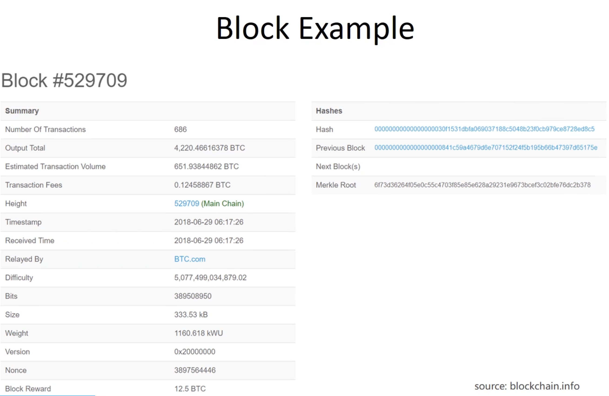

## 左侧信息
这个区块里包含了686个交易，总输出是4220.466xxx个比特币，总交易费是0.12458xxx BTC，这是686个交易的交易费累加之后的值。

最下面一行是出块奖励，12.5BTC。所以目前矿工挖矿的主要动力还是为了出块奖励。
Height是区块的序号。Timestamp是区块产生的时间。Difficulty是挖矿的难度，每隔2016个区块，区块链会调整这个难度，保持全网出块时间是10min左右。nonce是挖矿时找到的随机数。

## 右侧信息
第一个hash是block header的hash值。previous block是前一个区块header的hash值。
Merkle root表示这个区块中的交易组成的merkle tree，它的root hash value。

# Block Header数据结构
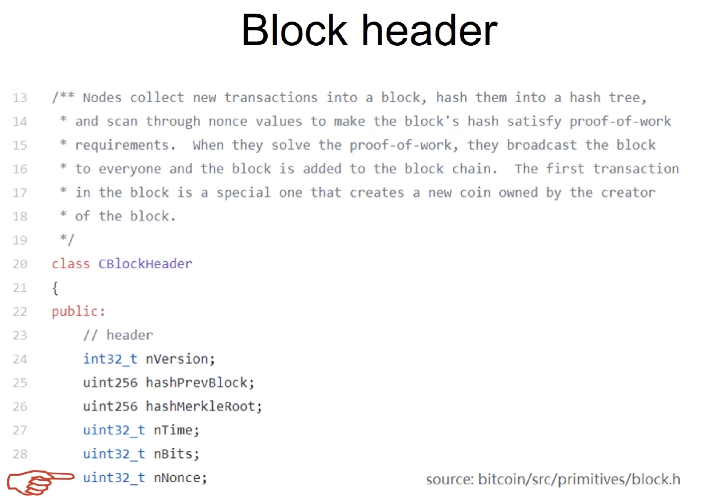

nNonce类型是32位无符号整型，有2^32次方可能的取值。

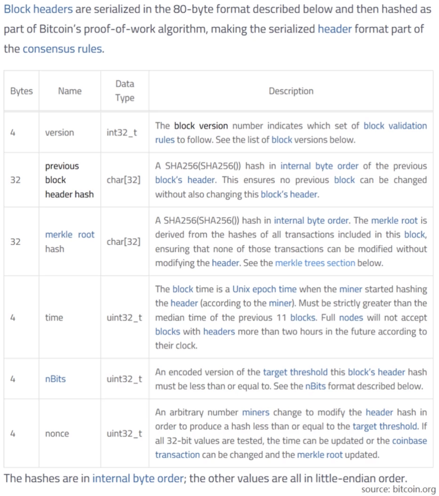

version字段是当前使用的BTC版本，无法更改。
第二个字段是前一个BTC区块的header hash，无法更改。
第三个是merkle root hash，无法更改。
第四个字段是区块产生的时间，有一定调整余地。
第五个字段是挖矿目标阈值，只能按照协议要求定期调整，不能随便改。
第六个则是nonce。

以上六点里，挖矿时调整的除了nonce之外，还有root hash。
原理就是区块的铸币交易里，没有输入，因为BTC是凭空造出的。交易有一个CoinBase字段，内容是可以写任何内容。
这个域的内容会对block header的root hash造成什么影响呢？

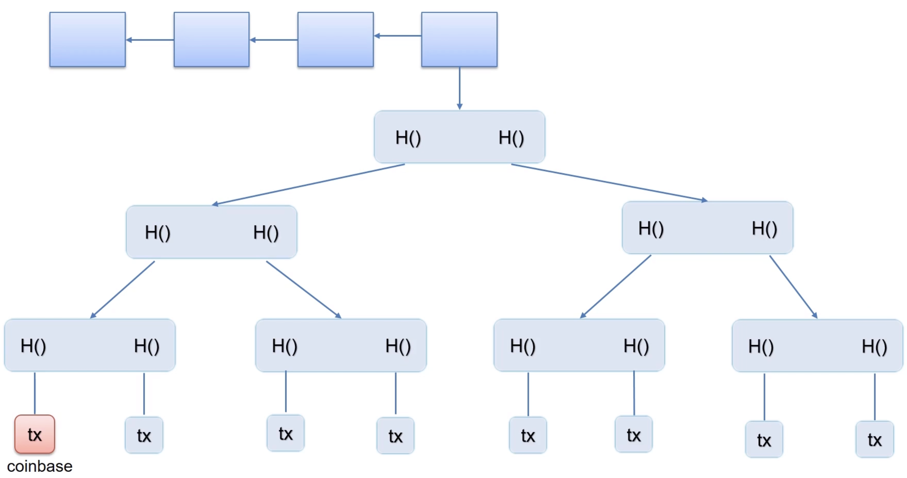

上面的区块链里，最后一个节点的merkle tree结构如图所示。左下角的交易是coinbase transaction，改了coinbase字段内容后，节点的hash就会变化。逐级向上传递后，就会最终改变root hash value。
挖矿时，只改nonce是不够用的，可以将coinbase当作extra nonce字段使用。

也就是说挖矿时的程序，是有两层循环，外层改coinbase，内层改nonce。

# 交易
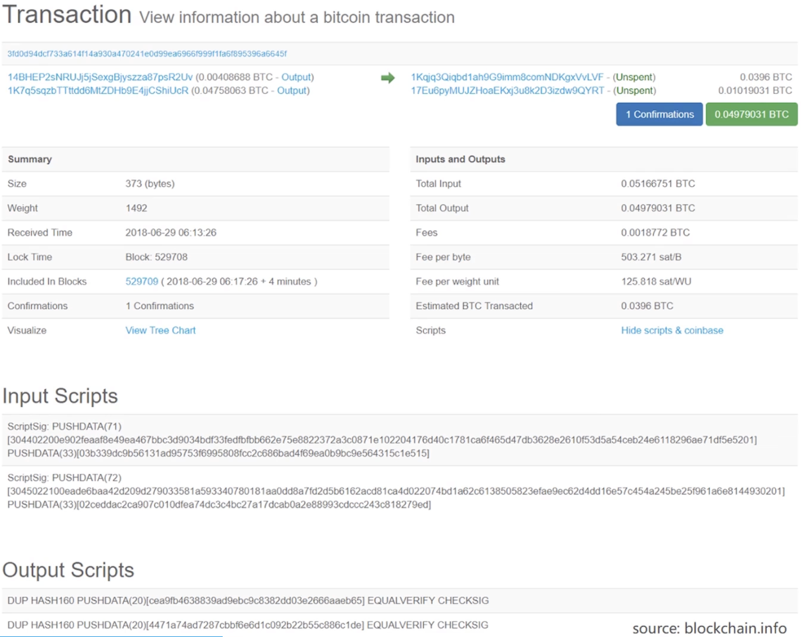

上面的交易里，有两个输入和两个输出。两个输出都是unspent，会保存在UTXO里。

最下面是输入输出脚本，BTC网络中验证交易合法性，就是将一个交易的输入脚本，和它前一个交易，提供B来源的输出脚本，拼在一起执行。

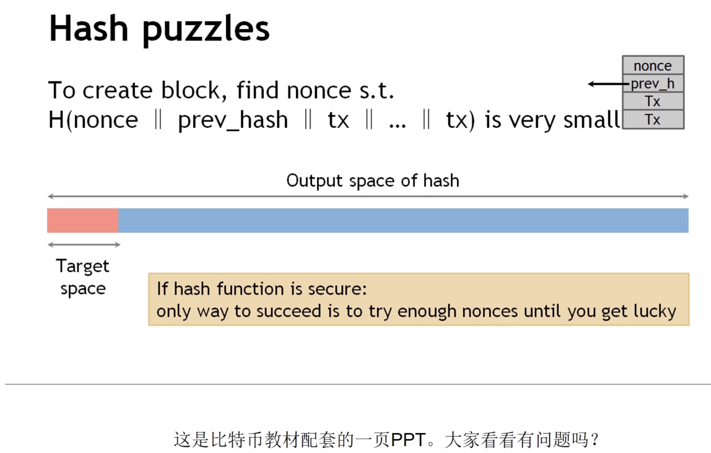

上面这幅图的问题是，Hash计算公式里，包含了所有的交易具体信息。实际上只有交易merkle tree root hash。
> 这里原本教材的意思可能是想表达，merkle root hash也能代表所有交易信息。肖臻老师这里所说的问题我觉得也不算大问题。

# 挖矿的概率
挖矿本质就是不断尝试各种nonce，来求解puzzle。每次尝试nonce可以看作是Bernoulli trial a random experiment with binary outcome。
多次尝试的Bernoulli trial构成了Bernoulli process a sequence of independent Bernoulli trial。
Bernoulli process一个性质是无记忆性。只有足够多次数的尝试，才有可能找到nonce。这时可以用Poisson process来近似。我们所关心的整个系统中的出块时间，可以推导出来，是服从指数分布。
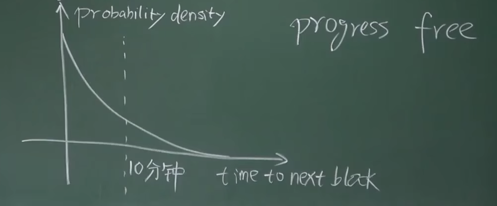
整个系统的平均出块时间保持在10min（由BTC协议保证）

这种机制可以保证系统中不同矿工的挖到区块的概率，和自己的算力占比保持一致。
# 比特币的总量
挖矿是BTC产生新区块的唯一途径，block reward每四年减半。
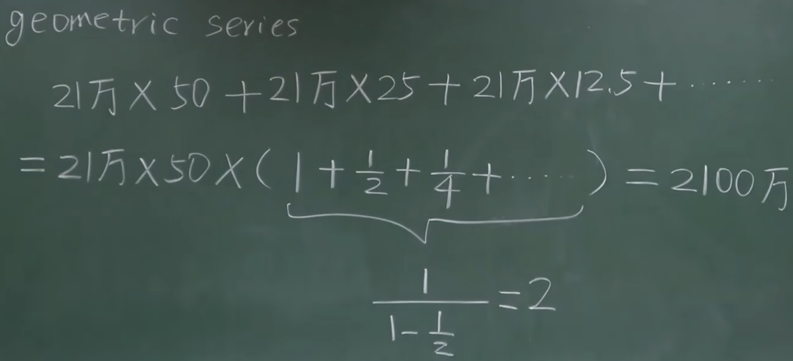

系统中BTC总量最终是2100W。

BTC越来越难被挖到的原因是出块奖励逐渐减少了。他的稀缺性是人为造成的。
BTC挖矿的过程，除了比拼算力，没有别的实际意义。但是挖矿对于维护BTC系统安全性，是至关重要的。
> BitCoin is secured by mining

对于去中心化系统，挖矿提供了一种凭借算力投票的有效手段。只要大部分算力是掌握在诚实节点手里，系统安全性就可以得到保证。
所以挖矿的过程表面上看耗费电力，没有实际意义，但对于系统的安全性是非常有效的维护。

随着出块奖励的逐渐减少，矿工挖矿的热情不会降低，因为BTC价格是升高的。而且还有第二种激励机制，交易费。
# 比特币的安全性
假设大部分算力是在诚实矿工手里，能否保证写入区块链的交易都是合法的？
只能说比较大的概率是，但不能保证记账权不会落到恶意节点手里。比如诚实矿工占90%手里，10%在恶意节点手里。这时仍有10%概率，记账权会落到恶意节点手里。

此时，恶意节点能不能把别人掌上的钱转给他自己？答案是不能，因为它没有办法伪造签名。如果硬写到区块链中，诚实节点不会认它，写入新的区块时，不会在伪造节点后面写入，而是产生新的分支。这对于恶意节点来说成本很高。
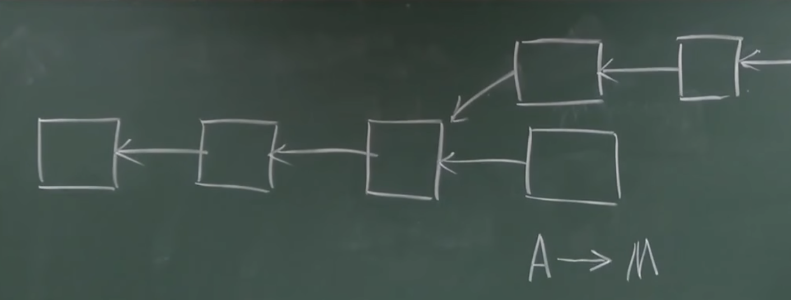

第二个问题，恶意节点能否进行双花攻击？
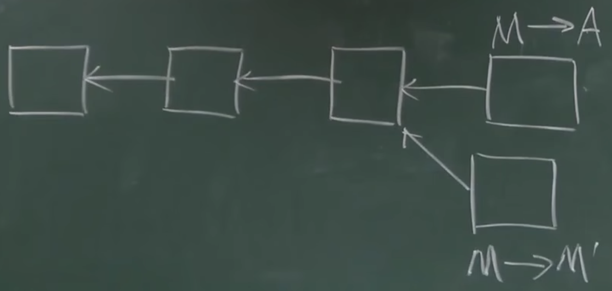

> 需要注意的是，区块插入在哪个位置，是要在挖矿时就决定的，因为blockheader里要填入前一个区块的hash 指针。

上图中是forking attack的场景，最终BTC系统里会有一个分支胜出，另一个分支做废掉。这种攻击的目的是什么？

当M->A的转账已经在外部系统中产生一些不可能的影响，但是又被下面的分支回滚了，恶意节点就可以获得一些不当获利。例如网络购物。

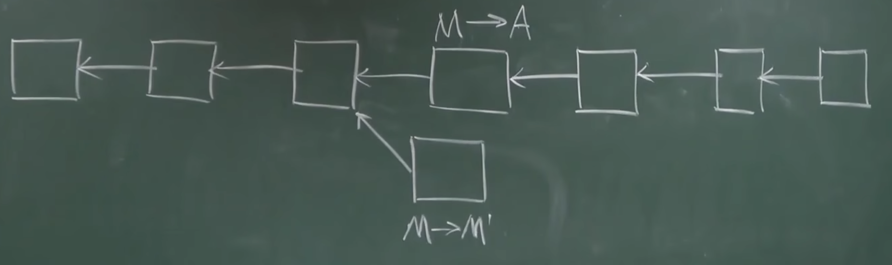

如果网络中大部分算力掌握在诚实节点里，那么记账权大多数情况下是在诚实节点手里，上面的分支会成为最长合法链。
恶意节点想回滚交易，只获得一次记账权是不够的，还需要很多次获得记账权，写入新的区块。
所以防范这种攻击的方式，比较简单的就是多等几个区块确认。
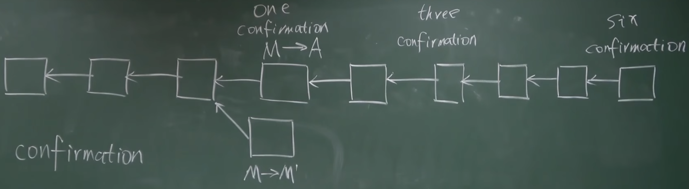
BTC默认要等6个confirmation，这时才会认为前面的交易是不可篡改的。平均出块时间是10min，加起来就是要等待1h。

所以，BTC的不可篡改性，是指一个区块后面跟着很多区块，此时被篡改的概率，呈指数级下降。

## Zero confirmation
转账交易发布出去，但还没有被写入区块链。对应上图的场景：

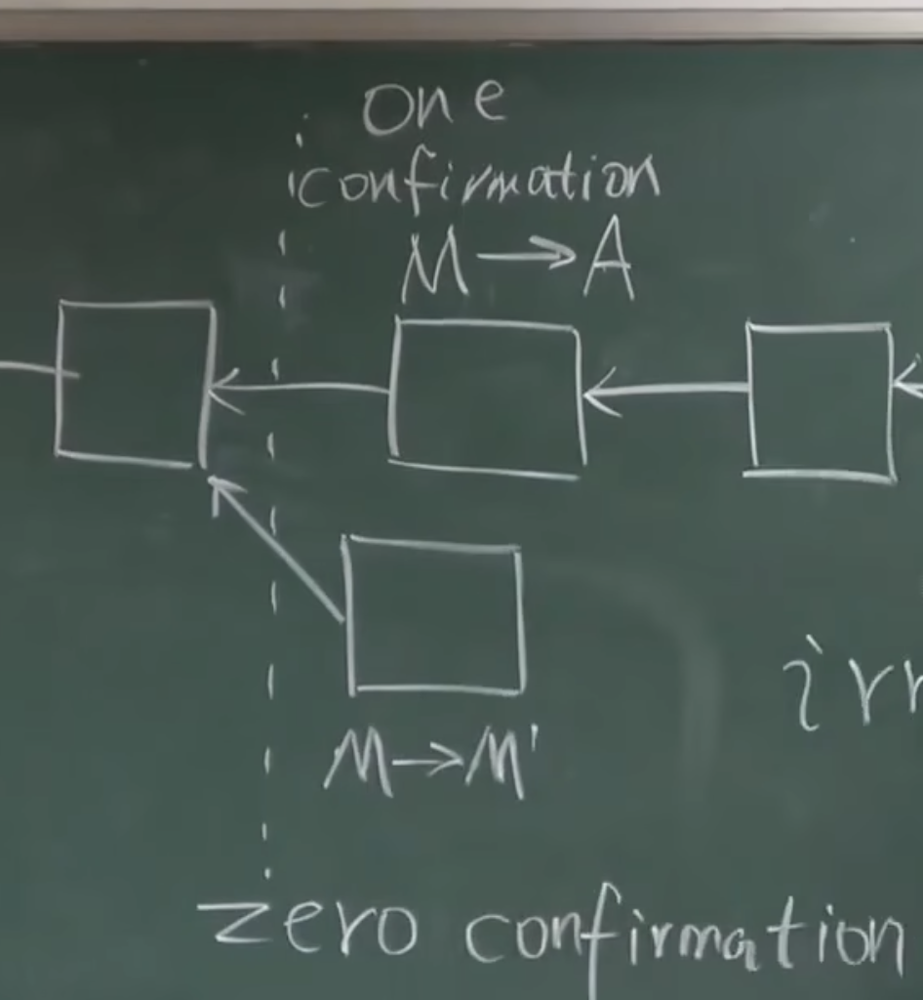

在电商购物的例子里，支付时发布一笔转账交易，电商收到后，电商本身运行全节点，或者委托别的全节点，监听链上的交易。收到转账交易后，验证合法性，有合法的签名和来源。
但不需要等交易被写入到区块链中。这种方式听起来风险很大，但实际中应用比较普遍。
原因有二：
1. BTC默认设置节点接收最先听到的那个交易，如果两个交易冲突，就是先听到哪个，就接收那个
> 当诚实节点先收到M->A的交易，接收它，之后再收到M->M\`的交易时，大概率不会接收
2. 电商场景里，从收到支付，到发货给买家，这期间有足够的处理时间。如果这期间发现转账交易没有被写入最长合法链上，就会取消发货。这是BTC系统之外的手段

恶意节点可以选择不写入合法的交易。此外在正常的交易中，也可能会出现漏写合法交易的情况。 
BTC规定一个节点最大大小是1M，那么到达上限以后，有的交易只能等到下一个区块再发布。

## Selfish mining
正常情况是每挖到一个区块，就立即发布出去。但在这个攻击场景里，挖到区块先藏着不发布。利用forking attack的时机，一次性全部发布出去。

这种攻击发布方式有一个前提就是恶意节点必须占据一半以上的算力，这样子才有可能比正常节点更快的挖出足够多的区块。

除了上面这种攻击的目的，selfish mining