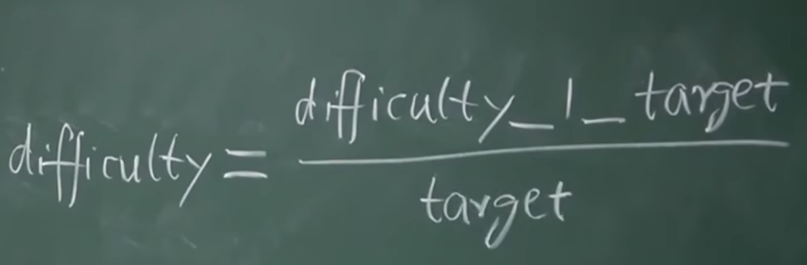
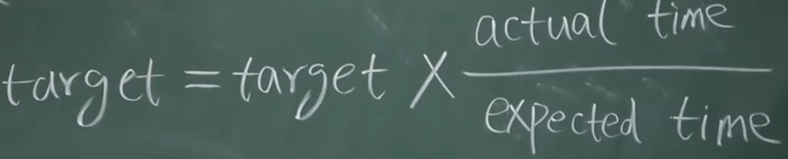
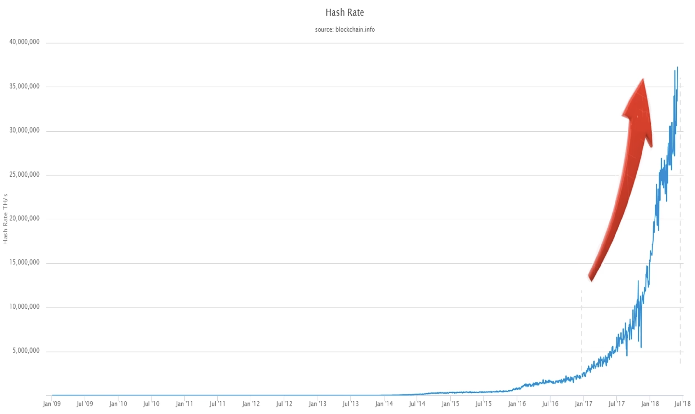
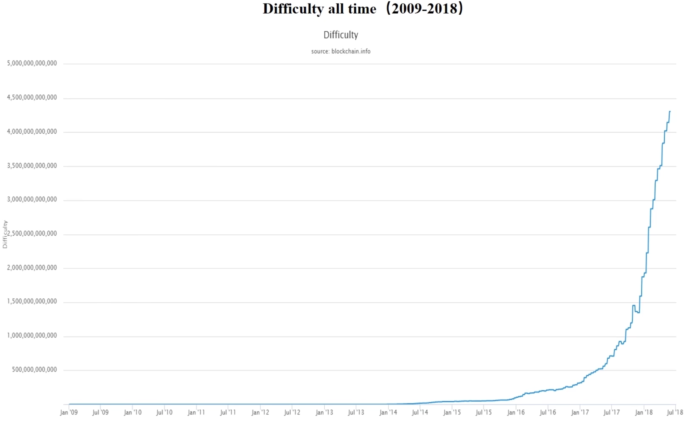
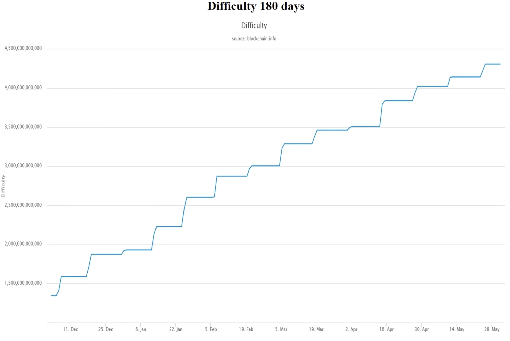
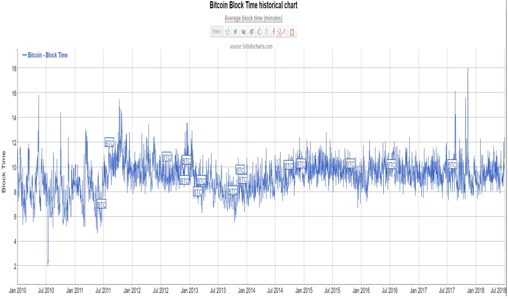
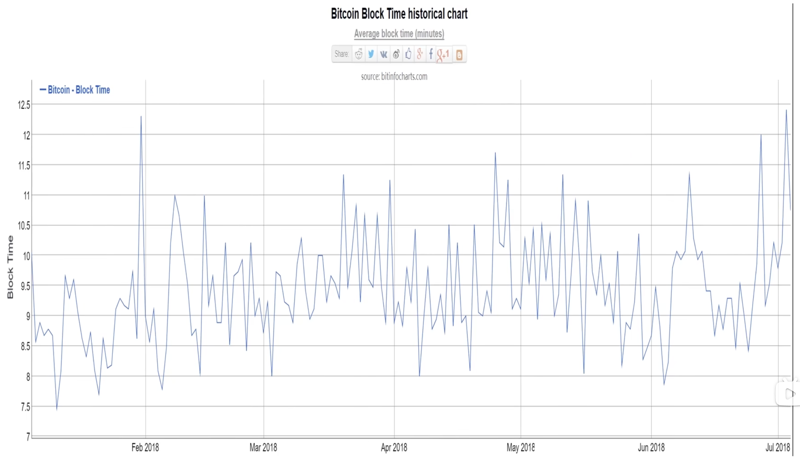

挖矿就是不断尝试blockheader里的nonce值，是的block header的hash值，小于等于给定的目标阈值。
> H(block header) <= target

target值越小，挖矿难度越大。调整挖矿难度，就是调整目标空间，在整个生成空间中占的比例。

BTC采用的hash算法是SHA-256，产生的值是256位，所以总共有2的256次方个可能的取值。挖矿的难度，和目标阈值大小，成反比。

difficulty_1指的是挖矿的最小难度。

# 调整的原因
系统中矿工的算力越来越强，挖矿难度不变的话，出块时间会越来越短。这样子看起来可以让交易信息更快的被打包。
## 出块时间短的问题
假设出块时间是1s，一个区块产生时，在网络中传播的时间可能需要几十秒。别的节点没有收到区块之前，还在继续沿着已有的区块链在扩展。
如果有两个（甚至更多）节点同时发布了区块，会出现多个分叉。分叉过多会导致达成共识过慢，且威胁安全性。
BTC协议是假设大多数算力掌握在诚实矿工手里。系统中总算力越强，安全性就越好。因为攻击者要掌握51%算力的难度更大。
如果出块时间太短，诚实节点的分叉分布比较离散。但恶意节点会集中算力，扩展自己的恶意分叉。这样会导致全网的记录被污染。

### ETH的出块时间
15s，此时ETH采用的共识协议为Ghost。区别是orphan block不能直接丢弃，而是给一部分激励，叫做uncle reward。
ETH也要调整挖矿难度，使出块时间保持稳定。

## 原则
不论出块时间设计为多长，都要保持稳定，不能无限制的减少下去。

# 调整挖矿难度的方法
BTC协议中规定，每隔2016个区块，重新调整目标阈值。周期大概是every two weeks。
调整target的公式为

expected time就是2016 * 10min，约等于两星期。actual time是系统中最近产生2016个区块用的实际时间。

实际代码实现中，会有四倍的限制。不会调整超过4倍。这是为了避免系统中出现一些意外情况，导致目标阈值出现大的波动。反过来，如果最近2016个区块的出块时间小于半星期，也只按照半星期来算。

## 协调方式
怎么让全网所有矿工都按照这个规律去调整挖矿难度？
这部分功能是写进BTC代码里的，到周期会同步调整。如果恶意节点不调整target阈值，它挖到的区块，header中的nBits域是target的编码映射，有4个字节。此时诚实矿工对这个区块的检查会不通过。

# BTC系统中的实际情况
如下图所示，全网算力的增长速度，与BTC的价格增长基本保持一致。

下图是挖矿难度的增长情况

可以看出和算力增长基本保持一致。这也符合BTC难度调整的设计目标，通过调整挖矿难度，使出块时间保持稳定。

下图是最近半年的难度调整曲线（视频发布于18年）

可以看出难度调整是一段一段的，每隔2个星期，难度上一个台阶。可知参与BTC挖矿的人越来越多，设备越来越好，算力也越来越强。

如果出现相反情况，比如某个加密货币挖矿难度越来越小，说明大家对于这个币的热情是逐渐减少的，持续出现这种情况的话，这个币就会慢慢不行了。

上图是BTC的每天出块时间，从2010-2018.总的来说，出块时间在10min上下振动，说明难度调整达到目的。

下图是最近半年（2018）的平均每日出块时间

