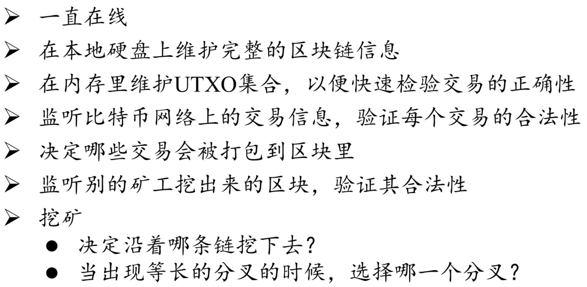
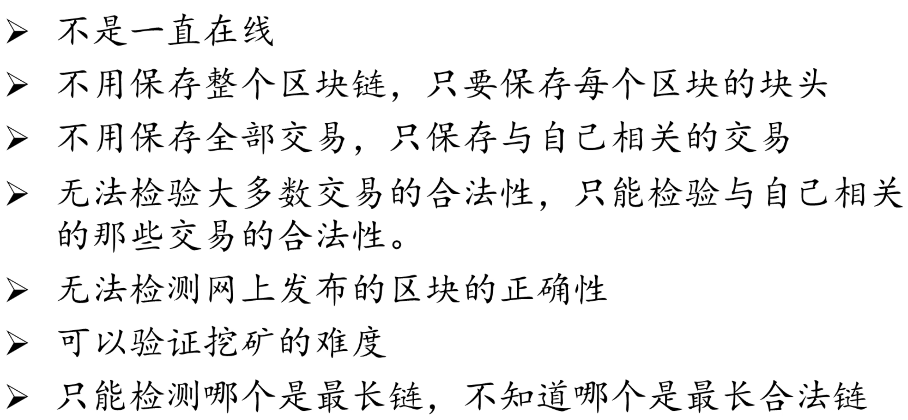
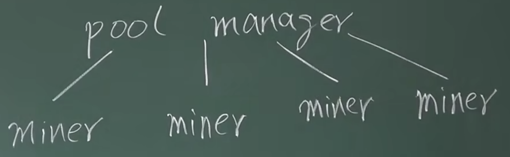
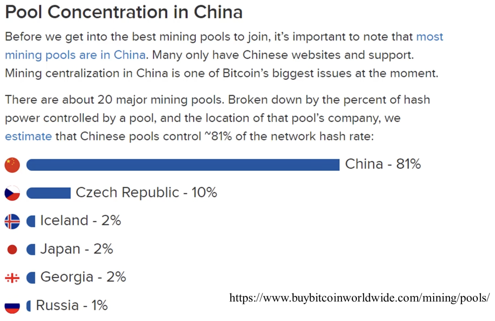
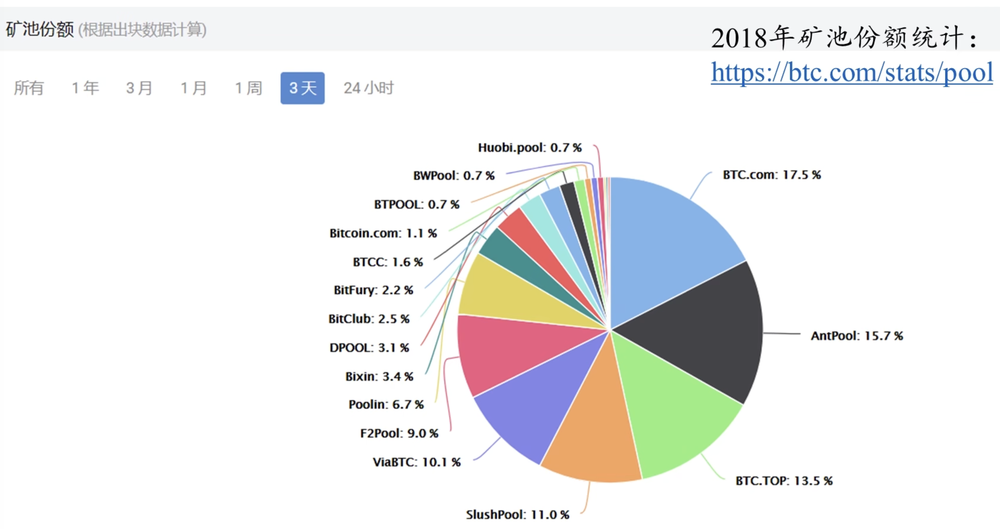

# BTC中的节点
- 全节点

- 轻节点

BTC网络中，只进行交易，转账的话，只运行轻节点就够了。

在挖矿过程中，如果监听到别人发布的区块，这个区块是合法的，也是在最长合法链上，此时全节点应该怎么做？
1. 立即停止挖矿
2. 重新在本地组装一个候选区块，重新进行挖矿

放弃之前的区块并不可惜，因为BTC挖矿的过程是无记忆性的(memoryless)，每次计算得到符合要求nonce的概率是相同的（独立随机事件）。

BTC的安全性，是由两部分保证的
1. 密码学上的公私钥，保证数字签名不会被伪造（前提是系统中大部分节点是诚实节点）
2. 共识机制，保证交易不会被篡改

# 挖矿的设备
第一代：以CPU为主
最早的挖矿设备就是普通的家用PC，笔记本电脑。但是这种不划算，因为挖矿过程不需要太多内存、通用CPU算力和硬盘。

第二代：以GPU为主
利用GPU强大的并行计算能力，进行挖矿计算。但GPU是为了通用并行计算设计的，用于挖矿时，内部很多部件仍然处于闲置。比如用于浮点数运算的部件。这些部件对于深度学习很重要，但比特币挖矿只用到了整数计算。

第三代：ASIC芯片
专门为挖矿设计的芯片，上面没有多余的电路逻辑，完全为了挖矿计算而服务。干不了别的。而且为某一种加密货币设计的ASIC芯片，没法用于别的货币。除非两者用同一种mining puzzle。
某些新发型的加密货币为了解决冷启动问题，会专门选择和已有加密货币相同的mining puzzle。这样可以吸引更多矿工。这种情况称为merge mining。

# 矿池
将很多矿工组织在一起。一个全节点驱动很多矿机。

矿工只负责计算Hash value，全节点的其他职责由pool manager承担，如监听网络中的交易，打包区块等。

矿池的出现还有另一个目的，就是收入不稳定。这里一个矿池获得的收益由所有人分享。一个大的矿池里有成千上万的矿机。如果矿机是来自于不同机构，分布在世界各地，如何分配收益？

要按照每个矿工的贡献大小，即POW工作量证明来分配。如何证明呢？
矿主设定一个almost valid block，难度相对BTC官方设定略微简单一些。矿工挖到后，称作一个share，提交给矿主，矿主根据提交数量，来作为工作量评判。
将来如果某个矿工真的挖到了区块，再根据各个矿工提交的share数目进行收益分配。

有没有可能矿工挖到区块后，不提交给矿主，自己发布。
这是不可能的，因为每个矿工任务由矿主分配。矿主负责组装好一个区块交给矿工去尝试nonce。而且除了nonce外，还需要调整coinbase。矿主还需要调整这个域。coinbase transaction中有一个收款人的地址，填的是矿主的地址。所以矿工挖到区块后，自己提交上去，也无法获得收益。

# 统计数据
算力分布

矿池分布

