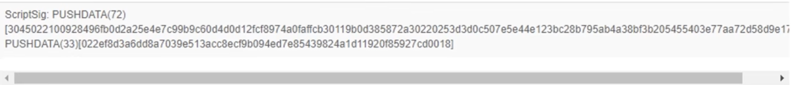
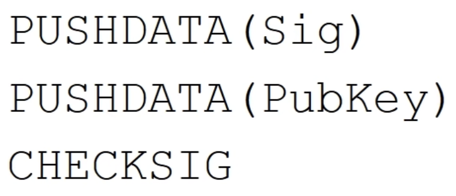
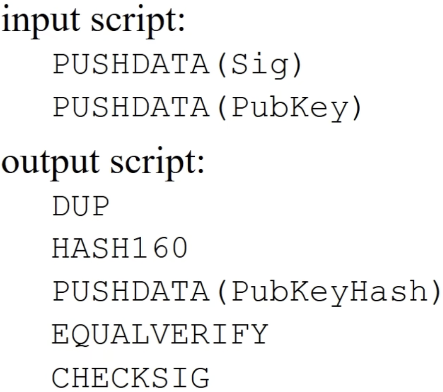

# 交易实例

交易有一个输入，两个输出。
输入：

含义是这个交易使用的BTC，是来自于前面哪个交易的输出。

输出：

两个输出其中下面的已经花出去了，上面的还没有花出去。

确认：

交易已经收到23个节点确认，回滚的可能性很小。

输入脚本：

包含两个操作，分别把两个很长的数压栈(PUSHDATA)。

BTC使用的脚本语言很简单，唯一能访问的内存空间只有栈。所以BTC脚本又称作Stack Based Language。

输出脚本：

脚本中的两行分别对应上面的两个输出，每个输出有自己单独的一段脚本。

# 交易具体内容
## 交易结构

txid: 交易ID
hash：交易hash
version：使用BTC协议版本
size：交易大小
locktime：交易的生效时间。非零值时，交易要过一段时间才生效。
vin & vout：后续详细讲
blockhash：交易所在区块的hash
confirmation：交易已有多少个确认信息
time：交易产生的时间
blocktime：区块产生的时间

vin结构：

vin结构是一个数组，每个交易都有可能有很多个输入。本例中只有一个输入。每个输入都要说明花的币的来源交易。
txid：币的来源交易的ID
vout：来自于第几个输出
scriptSig(input script)：输入脚本最简单的形式就是给出签名，证明交易者有权花这币BTC。一个交易可以有很多歌输入，每个输入都要有对应的签名。

vout结构：

vout也是数组结构，本例中有两个输出。
value：输出的金额，本例中单位是BTC
n：序号，表示是本交易的第几个输出
scirptPubKey(output script)：输出脚本最简单的形式是给出一个public key。
asm：输出脚本内容
reqSigs：输出需要多少个签名才能兑现。本例中是1个，后面会有需要多个签名的场景。
type：输出类型，均为公钥hash
address：输出的地址

# 脚本执行

上图是一个小型区块链，前面区块中有一笔A->B的转账交易，B收到后，B将这些币转给C。

这个例子里，B给C的比特币，其来源是前面A给B的转账。
要验证合法性，则需要把B转给C的输入脚本，和A转给B的输出脚本，拼接在一起执行。

拼接时，将两个脚本交叉，输入脚本放在前面，输出脚本放在后面。
执行过程，早期BTC的实现里，是拼在一起从头到尾执行一遍。后来考虑安全因素，改为分开执行。先执行输入脚本，无报错再执行输出脚本。如果能顺利执行，且最终栈顶结果是非零值(true)，则验证通过，交易合法。
如果交易有多个输入脚本，则每个脚本都要和交易的输出脚本匹配，进行验证。全部通过后，才证明合法。

# 输入输出脚本的几种形式
## P2PK(Pay to Public Key)
输出脚本里直接给出收款人公钥。

checksig是检查签名的操作。签名是用私钥对输入脚本所在的整个交易的签名。

这种形式是最简单的，因为pub key是直接在输出脚本里给出了。

实际执行：

这三行是将输入输出脚本拼接后的情况，实际中是分别执行的，这里为了方便，拼接在其显示。

第一条语句是将输入脚本提供的签名压入栈。第二条是将输出里提供的公钥压入栈。第三条是将栈顶两个元素弹出，用公钥检查签名是否正确。

### 实例

上图是P2PK的实例，上面的输入脚本就是将签名入栈。下面的交易是上面交易的输入币的来源，内容有两行，第一行是将公钥入栈，第二行是检查签名。

## P2PKH(Pay to Public Key Hash)

这与P2PK的区别是输出脚本里没有直接给出收款人的公钥，而是公钥的Hash。公钥在输入脚本里给出，输入脚本里既要给出签名，又要给出公钥。
这种脚本是最常用的形式。

前两条语句将签名和公钥压入栈。
第三行DUP的含义是将栈顶元素复制，此时栈顶有两个pubkey。
HASH160将栈顶元素弹出，取hash，然后将hash值再入栈。此时栈顶是pubkey的hash。
接下来是将输出脚本中提供的公钥hash，压入栈。
接着弹出栈顶两个元素，比较两个元素。防止有人冒名顶替。
最后检查签名。

### 实例

本节开头给出的交易例子，用的就是P2PKH形式的脚本。

## P2SH(Pay 2 Script Hash)

P2SH是最复杂的一种脚本形式。这种输出脚本给出的不是收款人公钥Hash，而是收款人提供的一个脚本的Hash，叫做redeem script赎回脚本。

验证时分为两步。

### 实例

这部分略过了，等后面遇到了再详细看吧。。
[BTC脚本](https://www.bilibili.com/video/BV1Vt411X7JF/?p=9&spm_id_from=pageDriver&vd_source=4843402b7dad600460dc18192579a93e)

使用这么复杂的脚本形式，主要目的是为了更好的支持多重签名。

# Proof of Burn

return操作作用是无条件的返回错误，所以包含他的脚本，永远不会通过验证。

这个脚本是为了证明销毁BTC的一种方法。应用场景：
1. 小的币种要求销毁一定数量的BTC，才能得到它。AltCoin。
2. 向区块链中添加内容，如Digital Commitment。

类似的场景还有之前说过的挖矿过程中，向Coinbase交易里写入信息。如下图所示：

# 总结

BTC脚本语言是很简单的，不支持循环等逻辑结构。相比之下ETH的智能合约语言更为复杂，所以使用了Gas Fee机制，保证不会陷入死循环。