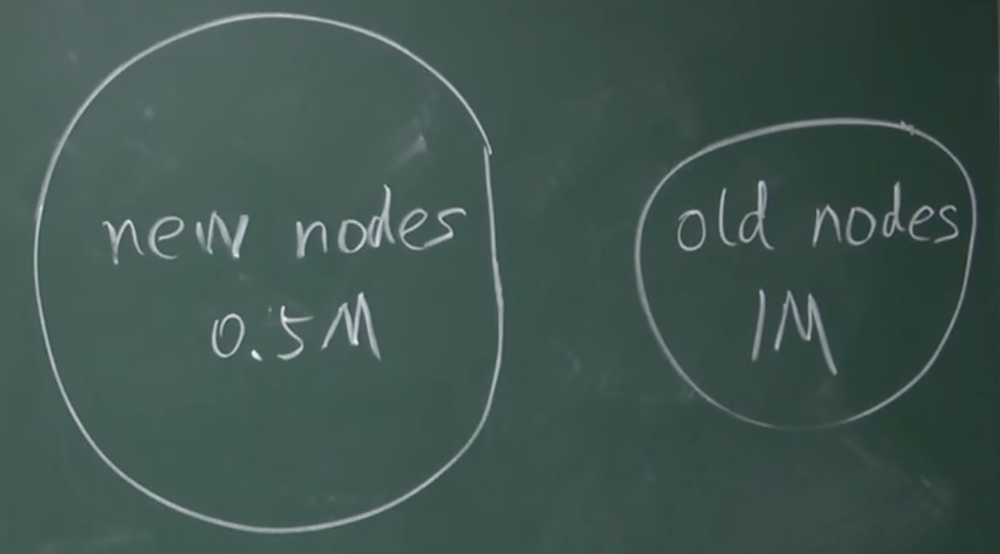

# 概念
由原来的一条链，分成了两个或更多的链。可能是由两个矿工同时挖到区块，导致分叉。这种称作state fork，由于对BTC当前状态有意见分歧，导致的分叉。
此外还有forking attack的场景，这也属于state fork。只是这个意见分歧是故意认为造成的，deliberate fork。

除了state fork，还有BTC协议发生改变时产生的fork。当BTC协议升级时，网络中没法保证所有节点都升级了软件。如果一个网络中大部分节点升级了，少部分未升级。此时也会出现分叉，这种分叉叫做protocol fork。

# 硬分叉和软分叉

## 硬分叉Hard fork
如果对BTC协议增加特性，扩展功能。没有升级软件的旧节点，就可能认为这些特性是非法的，此时就是对BTC协议内容产生分歧，导致分叉。

具体的例子有区块大小限制。BTC规定每个区块是1M大小，按照每个交易250字节来算，总共大约可以包含4000比交易。

区块每10min产生一个，则算下来平均每秒7比交易。

这个限制比较低。有人认为限制了BTC的发展，也加大了交易延迟，提出要增加block size limit。

假设此时有人发布了软件更新，将size limit从1M增加至4M。大部分算力节点更新了软件，少数没更新。

就会产生节点大小的分歧。此时系统运行起来，会导致少数没更新软件的节点，不承认4M的区块，

只要少数节点不更新软件，这样子的分叉就是永久性的。两条链独立运行，互相不承认产出区块和BTC。分裂前的货币，就一分为二，两边各拿一份。

这样会有一个问题，就是恶意用户会将其中一个链上的交易，在另一个链上回放。比如A向B在链1上转一笔账，B将这个交易在分裂出的链2上回放。因为理论上A和B的公私钥都没有变化，所以有可能这比回放交易会通过验证。

这是ETH真实发生过的案例。后来解决措施是两条链各带一个chain ID，作为标记。

# Soft fork
假设有人发布软件更新，将block size limit从1M改为0.5M。

新节点开始挖0.5M的小区块，旧节点会承认。旧节点挖出的1M大区块，新节点不会承认。

会造成旧节点算力的大量浪费。但是系统不会有永久性分叉。

# 实际场景
## 给某些目前协议没有规定的域增加新的含义，赋予新的规则

一个例子是coinbase域，之前说挖矿时，可以拿到当作extra nonce，扩大输入范围。实际中，将其前八个字节当作extra nonce。输入范围由2的32次方，增加到2的96次方。

coinbase域前八个字节拿出来挖矿，剩下的字节长度可以作为UTOX集合的root hash值。
> UTXO: unspent transaction output

目前UTXO只是每个全节点，在内存中维护的集合。主要是为了快速查找，判断交易是否是double spending。
但这个集合内容并未写入到区块链里。

假设现在要证明某个账户上有多少BTC，目前BTC系统中无法证明。如果是全节点，可以遍历UTXO，找到输出是A的地址的记录，算出A账户有多少余额。

有人提议将UTXO内容，组织称merkle tree，算出root hash，写在coinbase里。而coinbase里的内容本身也是block header hash计算的一部分，这样就可以用merkle proof。

这样，这种升级造成的分叉就是软分叉。因为新节点生成的区块，旧节点认为合法，不会去校验coinbase域其他字节内容。而旧节点生成的区块，会被新节点认为是非法的。

## BTC历史上的例子
BTC历史上比较著名的软分叉，是P2SH的应用。
旧节点验证新节点的交易，是合法的。新节点验证旧节点的交易，是非法的。

# 总结
Soft fork是指系统中半数以上算力的节点，更新了软件，就不会造成永久性分叉。
Hard fork是必须所有节点都要更新软件，系统才不会出现永久性分叉。如果少部分节点不愿意更新，系统就会分成两条链。